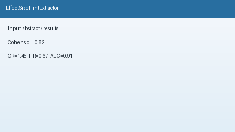

# Effect Size Hint Extractor Guide



`EffectSizeHintExtractor` scans title / abstract / results text for offline
effect-size cues (`Cohen's d = 0.82`, `OR=1.45`, `HR = 0.67`, `RR: 1.20`,
`AUC = 0.91`). It returns advisory metric labels with numeric values and the
matched cue string. It never calls the network.

Distinct from `SampleSizeHintExtractor` (N= sample-size integers). Fills an
Elicit / Consensus / SciSpace / PaperQA effect-size surfacing gap with
deterministic heuristics. Optional later narrative can use GPT-5.5 /
Claude Sonnet 4.6 / Gemini 3.x / Kimi K2.

## Usage

```python
from retrieval.effect_size_hint import EffectSizeHintExtractor

hints = EffectSizeHintExtractor().extract(
    [
        {
            "paper_id": "p1",
            "abstract": "The intervention yielded Cohen's d = 0.82.",
        },
        {
            "paper_id": "clear",
            "abstract": "We study transformers without reported effect sizes.",
        },
    ]
)
for hint in hints:
    print(hint.paper_id, hint.metric, hint.value, hint.matched_cue)
```

When multiple metrics match, Cohen's d is preferred over OR, HR, RR, then AUC.
Empty paper lists return an empty tuple. Inputs are not mutated.
