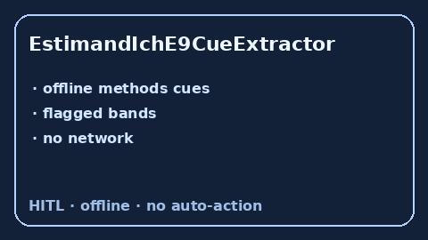

# EstimandIchE9CueExtractor Guide



Offline cue extractor. Never network. Closes Elicit / Consensus / ICH-E9(R1) estimand gaps.

Optional polish via **GPT-5.5 / Claude Sonnet 4.6 / Gemini 3.x / Kimi K2**.

Distinct from `IntentionToTreatCueExtractor / PrimaryEndpointCueExtractor`.

## Usage

```python
from retrieval.estimand_ich_e9_cues import EstimandIchE9CueExtractor

rows = EstimandIchE9CueExtractor().extract(
    [{"paper_id": "p1", "methods": 'The treatment-policy estimand was pre-specified.'}]
)
print(rows[0].flagged, rows[0].cues)
```
