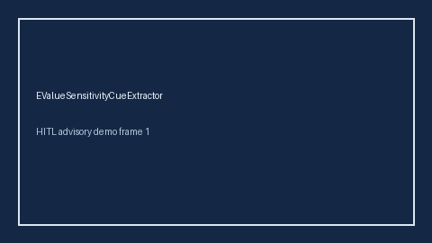

# EValueSensitivityCueExtractor Guide



Offline cue extractor. Never network I/O. Gap vs Elicit/Consensus/AJE E-value sensitivity cue extractors.

Optional later polish via **GPT-5.5 / Claude Sonnet 4.6 / Gemini 3.x / Kimi K2**.

Distinct from `ConfoundingAdjustmentCueExtractor / NegativeControlOutcomeCueExtractor`.

## Usage

```python
from retrieval.evalue_sensitivity_cues import EValueSensitivityCueExtractor

cues = EValueSensitivityCueExtractor().extract(
    [
        {
            "paper_id": "p1",
            "abstract": "We report an E-value sensitivity analysis for unmeasured confounding.",
        }
    ]
)
assert cues[0].flagged is True
```
