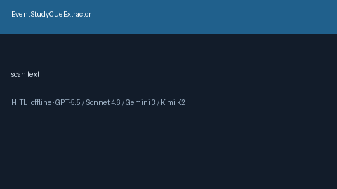

# EventStudyCueExtractor Guide



Offline cue extractor. Never network I/O. Gap vs Elicit/Consensus/AJE event-study cue extractors.

Optional polish via **GPT-5.5 / Claude Sonnet 4.6 / Gemini 3.x / Kimi K2**.

Distinct from `DifferenceInDifferencesCueExtractor / InterruptedTimeSeriesCueExtractor`.

## Usage

```python
from retrieval.event_study_cues import EventStudyCueExtractor

cues = EventStudyCueExtractor().extract(
    [{"paper_id": "p1", "abstract": "An event study with leads and lags supports parallel trends."}]
)
print(cues[0].flagged, cues[0].cue_kind)
```

## Safety

Advisory only. Humans decide. See `SAFETY.md`.
