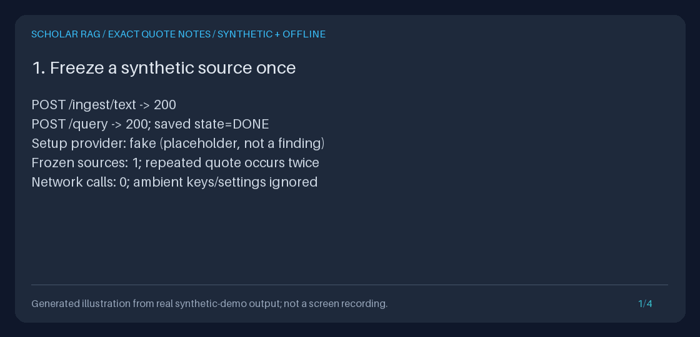

# Keep human notes on exact frozen evidence

`POST /runs/{run_id}/annotations` attaches a persistent human note to an exact
character span in a **completed saved run's frozen source text**.
`GET /runs/{run_id}/annotations` recovers newest-first, cursor-paginated history.
Both endpoints are integrated into the normal API; the standalone
`SQLiteEvidenceAnnotations` Python service needs only an existing SQLite database.

Use this when a passage repeats a phrase, when a collaborator needs the precise
wording behind an observation, or when the current corpus may change before a
review resumes. The selector combines exact document/chunk IDs, the full source
text's SHA-256, half-open offsets, and the exact quote. It never searches for a
replacement occurrence, normalizes text, or consults the current corpus.

**A note is a human opinion. A quote is provenance, not scientific entailment.**
There is no authenticated reviewer identity, highlighting UI, semantic
validation, active learning, or signed audit-proof claim. Whole-answer
[reviews](ANSWER_REVIEWS_GUIDE.md), collection [screening](PAPER_SCREENING_GUIDE.md),
and the opt-in [term-matching span aligner](EVIDENCE_SPAN_ALIGN_GUIDE.md) retain
their separate contracts and are not used to choose this selector.



This generated illustration comes from [actual offline API output](../assets/evidence-annotations.txt),
not a screen recording or fabricated terminal session. Its source and notes
are synthetic. The setup query uses the fake adapter; annotation requests use
neither a live nor fake model.

## Complete offline API workflow

With Python 3.11+ and uv, run these commands from the repository root.
Start an isolated loopback API in one terminal:

```bash
uv sync --extra dev
DATABASE_DIR="$(mktemp -d)"
printf 'Keep for restart: %s/corpus.sqlite3\n' "$DATABASE_DIR"
uv run --no-sync python - "$DATABASE_DIR/corpus.sqlite3" <<'PY'
import sys
from pathlib import Path
import uvicorn
from api.application import create_app
from scripts.demo_evidence_export import offline_settings

uvicorn.run(
    create_app(offline_settings(Path(sys.argv[1]))),
    host="127.0.0.1",
    port=8000,
)
PY
```

`offline_settings` validates explicit defaults while ignoring ambient
environment, dotenv, and secret-file settings. It clears all four model keys.
Simply setting the normal default provider to `fake` is not sufficient when a
preferred live provider has a key. This server has no authentication; keep it
on loopback. Stop it with Ctrl-C and reuse the printed database path to resume.

In a second terminal, create a synthetic source with two identical phrases:

```bash
BASE_URL=http://127.0.0.1:8000
OUTPUT_DIR="$(mktemp -d)"
curl --fail-with-body --silent --show-error "$BASE_URL/ingest/text" \
  -H 'Content-Type: application/json' \
  -d '{
    "title":"Synthetic annotation workshop note",
    "text":"Synthetic note; caf\u00e9 \ud83d\udd2c e\u0301. GraphRAG connects evidence. Again: GraphRAG connects evidence.",
    "source":"synthetic:evidence-annotations"
  }' > "$OUTPUT_DIR/ingest.json"
curl --fail-with-body --silent --show-error "$BASE_URL/query" \
  -H 'Content-Type: application/json' \
  -d '{"query":"What does GraphRAG connect?"}' > "$OUTPUT_DIR/query.json"
RUN_ID="$(uv run --no-sync python - "$OUTPUT_DIR/query.json" <<'PY'
import json
import sys
from pathlib import Path

result = json.loads(Path(sys.argv[1]).read_text(encoding="utf-8"))["result"]
if result["state"] != "DONE":
    raise SystemExit(f"Setup query failed: {result['error']}")
print(result["run_id"])
PY
)"
curl --fail-with-body --silent --show-error \
  "$BASE_URL/runs/$RUN_ID/export?format=json" > "$OUTPUT_DIR/evidence.json"
```

The setup performs ordinary retrieval and fake placeholder generation.
`/query` can return HTTP 200 with an `ERROR` run, so the command checks `state`.
The annotation endpoints do not run this setup again.

Create the selector **from the returned frozen text**, not the ingestion input,
an answer snippet, the current chunk reader, or rendered Markdown. Ingestion
can normalize whitespace; only the saved text is authoritative.

```bash
uv run --no-sync python - "$OUTPUT_DIR" <<'PY'
import json
import sys
from pathlib import Path
from uuid import uuid4

directory = Path(sys.argv[1])
bundle = json.loads((directory / "evidence.json").read_text(encoding="utf-8"))
source = bundle["snapshot"]["sources"][0]
text = source["chunk"]["text"]
quote = "GraphRAG connects evidence"
start = text.rindex(quote)  # Deliberately select the second occurrence on the client.
payload = {
    "annotation_id": str(uuid4()),
    "document_id": source["chunk"]["document_id"],
    "chunk_id": source["chunk"]["chunk_id"],
    "source_text_sha256": source["text_sha256"],
    "start": start,
    "end": start + len(quote),
    "quote": quote,
    "note": "Human opinion: inspect this occurrence; not proof of the claim.",
}
with (directory / "submission.json").open("x", encoding="utf-8") as output:
    json.dump(payload, output, ensure_ascii=False)
print(f"Selected [{start}, {start + len(quote)}): {quote}")
PY
curl --fail-with-body --silent --show-error \
  "$BASE_URL/runs/$RUN_ID/annotations" \
  -H 'Content-Type: application/json' \
  --data-binary @"$OUTPUT_DIR/submission.json" \
  --output "$OUTPUT_DIR/created.json" --write-out 'HTTP %{http_code}\n'
uv run --no-sync python -m json.tool "$OUTPUT_DIR/created.json"

# Retry exactly the same UUID and payload: HTTP 200, same record, no new row.
curl --fail-with-body --silent --show-error \
  "$BASE_URL/runs/$RUN_ID/annotations" \
  -H 'Content-Type: application/json' \
  --data-binary @"$OUTPUT_DIR/submission.json" \
  --output "$OUTPUT_DIR/replayed.json" --write-out 'HTTP %{http_code}\n'
cmp "$OUTPUT_DIR/created.json" "$OUTPUT_DIR/replayed.json"
curl --fail-with-body --silent --show-error \
  "$BASE_URL/runs/$RUN_ID/annotations?limit=20" | uv run --no-sync python -m json.tool
```

The first POST returns **201**, the identical retry **200**. A valid but changed
payload with the same run/UUID returns **409**, even if its new chunk is absent.
Malformed request shapes still fail with 422. Do not generate a new UUID when
retrying after a connection failure; reuse the original UUID and payload.
UUID spelling is canonicalized, but selector/note content is not normalized.
The same UUID in another run is independent.

To add another opinion, submit a new UUID. There is no edit/delete endpoint or
implicit replacement. Any frozen snapshot source can be annotated, including
a retrieved source absent from the final answer's citations.

GET returns `{"annotations": [...], "next_cursor": ...}`. Supply a returned
non-null `next_cursor` unchanged as `cursor` to read older sequences. A null
cursor means the end. `limit=1` is useful for inspecting pagination after saving
two notes. Each page validates the lookahead row as well as returned rows.
New inserts do not shift older pages; separate requests do not create a
long-lived snapshot or audit unseen pages for corruption.

## Complete Python workflow

This executable example creates a temporary synthetic run, then uses the
standalone store rather than the API or agent to save and recover the note:

```bash
uv run --no-sync python - <<'PY'
import asyncio
from pathlib import Path
from tempfile import TemporaryDirectory
from uuid import uuid4
from agent.markdown import literal_block
from api.application import create_app
from retrieval.models import Document
from scripts.demo_evidence_export import offline_settings
from storage.evidence_annotations import AnnotationSubmission, SQLiteEvidenceAnnotations

with TemporaryDirectory(prefix="synthetic-span-notes-") as temporary:
    database = Path(temporary) / "corpus.sqlite3"
    container = create_app(offline_settings(database)).state.container
    container.ingestion_pipeline.ingest_documents([
        Document(
            document_id="synthetic/paper",
            title="Synthetic note, not a publication",
            text="GraphRAG connects evidence. Again: GraphRAG connects evidence.",
            source="synthetic:python-annotations",
        )
    ])
    run = asyncio.run(container.runner.run("What does GraphRAG connect?"))
    if run.state != "DONE":
        raise RuntimeError(run.error)
    source = container.evidence_exporter.export(run.run_id).snapshot.sources[0]
    quote = "GraphRAG connects evidence"
    start = source.chunk.text.rindex(quote)
    submission = AnnotationSubmission(
        annotation_id=uuid4(),
        document_id=source.chunk.document_id,
        chunk_id=source.chunk.chunk_id,
        source_text_sha256=source.text_sha256,
        start=start, end=start + len(quote), quote=quote,
        note="Human opinion: check the repeated wording before interpreting it.",
    )
    store = SQLiteEvidenceAnnotations(database)
    saved, created = store.create(run.run_id, submission)
    assert created
    replayed, created = store.create(run.run_id, submission)
    assert not created and replayed == saved
    reopened = SQLiteEvidenceAnnotations(database)
    page = reopened.list_annotations(run.run_id, limit=20)
    assert page.annotations == [saved] and page.next_cursor is None
    print(page.model_dump_json(indent=2))
    print(literal_block(saved.quote))
    print(literal_block(saved.note))
PY
```

For a real saved run, pass its existing database path and a selector copied
from its frozen export; do not re-ingest or re-query just to annotate it.
The store constructor adds only its table/index and needs an existing database.
Missing databases are not created. Each operation owns and closes its SQLite
connection. Creation uses `BEGIN IMMEDIATE`; evidence validation, retry lookup,
and insertion are atomic. GET uses one `mode=ro` transaction. Both feed bounded
saved events to the existing `EvidenceExporter`, not unbounded event-log reads.

Direct model construction raises Pydantic `ValidationError` for invalid fields.
Service calls revalidate even unchecked model copies; catch `EvidenceExportError`
(including its `AnnotationError` subtype) for sanitized `code`, `status_code`,
and message. `container.evidence_annotations` exposes the same service.
Normal app startup still initializes its other stores and reconstructs retrieval
indexes; the standalone annotation service does not need those stores or models.

## Exact selector, record, and limits

| Field | Contract |
| --- | --- |
| `annotation_id` | Client UUID, unique together with the run ID; no reviewer identity |
| `document_id`, `chunk_id` | Exact frozen identity, strict nonempty strings of at most 256 Unicode characters; case, whitespace, punctuation, slashes, and valid control characters are preserved |
| `source_text_sha256` | Lowercase 64-digit SHA-256 of the **whole exact UTF-8 source text**, not just the quote |
| `start`, `end` | Strict JSON/Python integers; `0 <= start < end <= len(source_text)` and at most 262,144; no bool, float, numeric string, normalization, or clamping |
| `quote` | 1-1000 Unicode code points, exactly equal to `source_text[start:end]`; whitespace and NUL are allowed if present in that span |
| `note` | 1-1000 Unicode code points, nonblank, valid UTF-8, no NUL; all accepted whitespace/content preserved |
| `schema_version` | Server `"1.0"`; unsupported persisted versions fail |
| `run_id`, `sequence`, `created_at` | Server-saved run identity, positive SQLite AUTOINCREMENT sequence, and UTC `Z` timestamp |

Offsets are **Python Unicode code points**, not UTF-8 byte positions, JavaScript
UTF-16 code units, grapheme clusters, original PDF coordinates, or rendered HTML
positions. An astral symbol occupies one offset; a combining mark is a separate
offset and can be selected on its own. Visually identical NFC/NFD strings can
have different digests and spans. There is no fuzzy or semantic matching.

| Boundary | Inclusive limit |
| --- | --- |
| Run ID | 1-256 valid-Unicode characters, no trimming; the ordinary HTTP route expects one URL path segment |
| Page size | Default 20; integer 1-100; newest sequence first |
| Exclusive cursor | Integer 1 through 9,223,372,036,854,775,807; selects `sequence < cursor` within that run |
| Successful JSON response | 262,144 UTF-8 bytes, including all JSON escaping and the cursor; 413 means request a smaller page |
| Stored annotation read | At most page size + 1 rows; preflight at most 16,384 UTF-8 bytes of text columns per record before hydration |
| Frozen event read | At most 100 events, 1,048,576 UTF-8 payload bytes each, 8,388,608 total event-field bytes; sizes checked in SQLite first |
| Frozen snapshot | Existing 50 sources and 262,144 UTF-8 context-byte cap remain unchanged |

UTF-16 SQLite databases receive an encoding-aware preflight followed by exact
UTF-8 accounting. Selected invalid/oversized records reject the operation,
not silently disappear or become empty successful history. The response-byte
limit applies to the compact API serialization; adding indentation independently
can make a Python-rendered copy larger. HTTP pagination uses unsigned ASCII
decimal integers and rejects repeated/unknown parameters, including on POST.

Sequence values increase database-wide, not just within a run, so gaps are
normal. They are ordering/cursor values, not annotation counts or timestamp
precision promises. There is no automatic annotation-count or retention cap.
Protect and manage the database and backups appropriately.

## Explicit failures

The handled annotation API errors below use `{"detail":{"code":"...","message":"..."}}`, with
fixed messages rather than raw input, saved text, SQLite errors, or paths.
Successful and handled-error responses include `Cache-Control: no-store` and
`X-Content-Type-Options: nosniff`; these are not access control.

| HTTP | Code | Meaning |
| --- | --- | --- |
| 404 | `run_not_found` | No saved events for that run |
| 404 | `annotation_source_not_found` | New selector's chunk is not in this frozen snapshot |
| 409 | `run_incomplete`, `run_failed`, `snapshot_unavailable` | Not a completed exportable run; no legacy backfill |
| 409 | `invalid_run_record` | Malformed, inconsistent, unsupported frozen evidence |
| 409 | `evidence_read_limit_exceeded` | Saved event count or byte budgets exceeded |
| 409 | `invalid_annotation_record` | Malformed/oversized stored row or an anchor no longer matching frozen evidence |
| 409 | `annotation_id_conflict` | Same run/UUID, different valid payload; original record unchanged |
| 413 | `annotation_response_too_large` | Complete requested page exceeds the response cap; no partial page |
| 422 | `invalid_annotation_request` | Invalid fields, unknown fields, run ID, or pagination |
| 422 | `invalid_annotation_selector` | Wrong document, digest, actual bounds, or exact quote |
| 503 | `annotation_storage_unavailable` | Missing, locked, inaccessible, or failed SQLite storage |

A valid completed run with no notes returns an empty page. Failed, incomplete,
legacy, or corrupt runs do not. If frozen evidence is corrupted, existing
annotations are never silently moved to another occurrence. Even an internally
rehashed replacement source disagrees with the saved annotation digest and
fails. Changes or deletion in **current corpus** tables do not invalidate notes.

## Reproduce the measured GIF and portfolio evidence

No running server, model credentials, downloaded paper, or network is needed:

```bash
DEMO_ROOT="$(mktemp -d)"
uv run --no-sync python -m scripts.demo_evidence_annotations \
  --output-dir "$DEMO_ROOT/results"
uv run --no-sync python -m scripts.create_evidence_annotations_gif \
  --transcript "$DEMO_ROOT/results/transcript.txt" \
  --output "$DEMO_ROOT/evidence-annotations.gif"
uv run --no-sync python -m json.tool "$DEMO_ROOT/results/checks.json"
```

The demo refuses any existing output directory, even an empty directory or
dangling symlink. Artifacts are created exclusively so a late writer is not
overwritten. The renderer rejects existing targets, wrong panel titles, oversized
transcripts, and text that would clip horizontally or vertically. It reuses the
existing Pillow renderer: four distinct readable 1120x540 frames, 3.5 seconds
each, labeled as a generated illustration from actual synthetic output.

The measured artifacts contain the original frozen export, the exact POST
payload, created/replayed/conflict responses, both cursor pages, full history
before/after restart, checks, and transcript. The demo asserts two exact
occurrences, 201/200/409 behavior, two immutable records, exclusive pagination,
and byte-identical history after changing/removing its synthetic current corpus
and restarting. It guards and counts annotation agent/corpus calls, event writes,
and network calls; all must be zero. The temporary synthetic database is removed.
Random run/annotation UUIDs and real UTC timestamps vary between demonstrations;
the measured summary transcript and rendered panels are reproducible.

For a portfolio walkthrough, show the source's two occurrences and the selected
offsets, the actual retry/conflict responses, both cursor pages, and matching
before/after history hashes from `checks.json`. Explain the custom state
machine, FastAPI API, Pydantic validation, HTTPX clients, and SQLite transaction
boundary. Do not present the GIF as a UI, a scientific-quality evaluation, or
live model availability evidence.

## Privacy and scope

Notes, exact quotes, IDs, timestamps, exports, logs, and backups can be sensitive.
Annotations are plaintext local metadata, with no auth, tenant isolation,
encryption, author attribution, or automatic erasure/retention job. Deleting
corpus data does not erase frozen evidence or annotations. Human edits are new
UUID records, not modifications to the original annotation. Treat note/quote
content as untrusted literal text; escape it or use `literal_block` when
displaying Markdown. Do not execute instructions, scripts, or links it contains.

Annotations do not alter answers, run events, snapshots, exports, comparisons,
screening decisions, retrieval rankings, prompts, or provider defaults. A local
database owner can rewrite both evidence and annotations; hashes detect
inconsistency, not a fully consistent malicious rewrite or forgery.

The **2026-10-02 America/Los_Angeles** primary-source review motivating this
bounded workflow examined [PaperQA's grounded citations/evidence](https://github.com/Future-House/paper-qa),
[RAGFlow's chunk inspection and traceable references](https://github.com/infiniflow/ragflow),
and [ASReview's persistent screening notes](https://asreview.readthedocs.io/en/latest/lab/screening.html).
These are inspiration, not dependencies, copied implementations/assets, or
claims of equivalent UI, automation, active learning, or semantic validation.

Today's official catalog check is recorded separately in the
[provider guide](PROVIDER_MODELS_GUIDE.md): OpenAI `gpt-6-astra` / `gpt-6.1-sol` /
`gpt-6-luna`, Anthropic Sonnet 5.5 / Opus 5.5 / Fable 5.1, GA Gemini 3.8 Flash,
and Kimi K3. Defaults and separately dated migration-contract checks are
unchanged, including Sonnet 5.5's no-tools `between_tools` / medium-effort path.
Annotations require no provider or credentials; catalog documentation does not
establish live inference compatibility or account entitlement.
