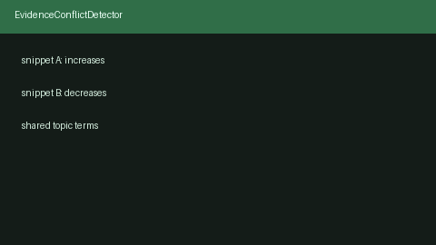

# Evidence Conflict Detector Guide



`EvidenceConflictDetector` scans pairs of evidence snippets for **opposing
polarity** (increase vs decrease, effective vs ineffective, support vs refute)
and negation clashes, returning left/right indices plus a reason string.

Distinct from `SelfRagReflectionGate`, which emits SUPPORT/PARTIAL/REFUSE over
`SearchResult` hits — this module produces an inspectable conflicting-evidence
list for synthesis UIs. Fills a Consensus / Elicit conflicting-evidence view
gap with offline heuristics (no LLM call). Optional later adjudication can use
GPT-5.5 / Claude Sonnet 4.6 / Gemini 3.x / Kimi K2.

## Usage

```python
from retrieval.evidence_conflict import EvidenceConflictDetector

detector = EvidenceConflictDetector(min_shared_terms=1)
conflicts = detector.detect(
    [
        "Treatment A increases survival in patients with sepsis.",
        "Treatment A decreases survival in patients with sepsis.",
    ]
)
for conflict in conflicts:
    print(conflict.left_index, conflict.right_index, conflict.reason)
```

Empty snippet lists (or a single snippet) return an empty tuple. Agreeing
snippets with the same polarity produce no conflicts.
