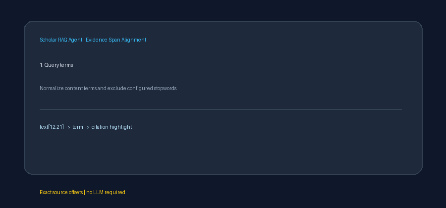

# Evidence Span Alignment Guide



`EvidenceSpanAligner` maps content terms from a query back to exact character
offsets in each retrieved `SearchResult` text. It provides deterministic
highlighting metadata similar to evidence extraction stages in Haystack-style
pipelines, without asking an LLM to reproduce or quote source text. Highlighted
evidence can later be shown to GPT-5.5, Claude Sonnet 4.6, Gemini 3.x, or Kimi
K2 while preserving exact source offsets.

## Span contract

Every `EvidenceSpan` contains:

- `start`: inclusive Python character offset.
- `end`: exclusive Python character offset.
- `term`: case-folded query term that matched.

The original evidence is always recoverable with
`text[span.start:span.end]`. Matching is case-insensitive, punctuation-safe,
Unicode-aware, and token-exact, so a query for `rag` does not highlight
`ragged`. Repeated evidence terms produce repeated spans in source order.

## Example

```python
from retrieval.evidence_span_align import EvidenceSpanAligner

aligner = EvidenceSpanAligner()
alignments = aligner.align(
    "graph-based retrieval evidence",
    retrieved_results,
)

for alignment in alignments:
    text = alignment.result.chunk.text
    highlights = [text[span.start : span.end] for span in alignment.spans]
    print(alignment.result.chunk.chunk_id, highlights)
```

`align()` preserves retrieval order and returns an alignment even when a result
has no matches. This keeps highlighting output positionally aligned with the
input result list. Use `align_text()` when only one text string needs offsets.

## Normalization and safety

- Shared retrieval stopwords are ignored by default.
- A custom stopword collection can be supplied at construction.
- Matching examines `chunk.text`, not the title, so offsets always refer to the
  same field.
- Query terms are deduplicated, but every occurrence in evidence is retained.
- Neither results nor their chunk text are copied or mutated.
- Empty, stopword-only, or no-result inputs return stable empty span
  collections.
