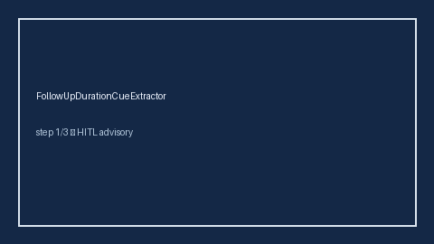

# FollowUpDurationCueExtractor Guide



Offline evidence cue extractor. Never calls the network.

Optional later narrative via **GPT-5.5 / Claude Sonnet 4.6 / Gemini 3.x / Kimi K2**.

Distinct from AttritionRateCueExtractor and SampleSizeHintExtractor.

## Usage

```python
from retrieval.follow_up_duration_cues import FollowUpDurationCueExtractor

rows = FollowUpDurationCueExtractor().extract(
    [{"paper_id": "p1", "abstract": "Median follow-up was 24 months."}]
)
assert rows[0].flagged is True
```
