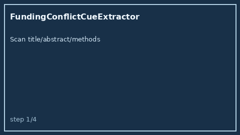

# FundingConflictCueExtractor Guide



Offline evidence cue extractor. Never calls the network.

Optional later narrative via **GPT-5.5 / Claude Sonnet 4.6 / Gemini 3.x / Kimi K2**.

Distinct from OpenDataAvailabilityFlagger and RetractionFlagger.

## Usage

```python
from retrieval.funding_conflict_cues import FundingConflictCueExtractor

rows = FundingConflictCueExtractor().extract(
    [{"paper_id": "p1", "abstract": "Industry-funded trial with COI disclosure."}]
)
assert rows[0].flagged is True
```
