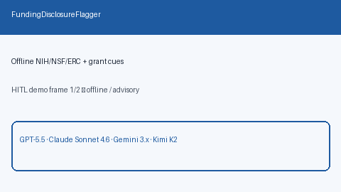

# Funding Disclosure Flagger Guide



`FundingDisclosureFlagger` scans abstract / acknowledgements / funding text for
offline funder cues (`NIH`, `NSF`, `ERC`, `funded by` / `supported by`, and
common grant-number patterns). It returns advisory flags with reasons and
matched cues. It never calls the network.

Distinct from the Crossref Funder Registry connector (`crossref_funder`).
Fills a Scite / Elicit / Consensus funding-disclosure surfacing gap with
deterministic heuristics. Optional later narrative can use GPT-5.5 /
Claude Sonnet 4.6 / Gemini 3.x / Kimi K2.

## Usage

```python
from retrieval.funding_disclosure import FundingDisclosureFlagger

flags = FundingDisclosureFlagger().flag(
    [
        {
            "paper_id": "p1",
            "abstract": "This work was supported by the NIH under award R01LM012345.",
        },
        {
            "paper_id": "clear",
            "abstract": "We study transformers without sponsor text.",
        },
    ]
)
for flag in flags:
    print(flag.paper_id, flag.flagged, flag.reasons, flag.matched_cues)
```

Empty paper lists return an empty tuple. Inputs are not mutated.
