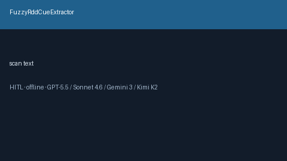

# FuzzyRddCueExtractor Guide



Offline cue extractor. Never network I/O. Gap vs Elicit/Consensus/AJE fuzzy regression-discontinuity cue extractors.

Optional polish via **GPT-5.5 / Claude Sonnet 4.6 / Gemini 3.x / Kimi K2**.

Distinct from `RegressionDiscontinuityCueExtractor / InstrumentalVariableStrengthCueExtractor`.

## Usage

```python
from retrieval.fuzzy_rdd_cues import FuzzyRddCueExtractor

cues = FuzzyRddCueExtractor().extract(
    [
        {
            "paper_id": "p1",
            "abstract": "A fuzzy RDD shows a treatment probability jump at the cutoff.",
        }
    ]
)
print(cues[0].flagged, cues[0].cue_kind)
```

## Safety

Advisory only. Humans decide. See `SAFETY.md`.
