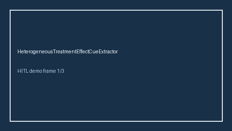

# HeterogeneousTreatmentEffectCueExtractor Guide



Offline cue extractor. Never network I/O. Gap vs Elicit/Consensus/AJE heterogeneous treatment effect / CATE cue extractors.

Optional later polish via **GPT-5.5 / Claude Sonnet 4.6 / Gemini 3.x / Kimi K2**.

Distinct from `SubgroupAnalysisCueExtractor / MediationAnalysisCueExtractor`.

## Usage

```python
from retrieval.heterogeneous_treatment_cues import HeterogeneousTreatmentEffectCueExtractor

cues = HeterogeneousTreatmentEffectCueExtractor().extract(
    [{"paper_id": "p1", "abstract": "We estimate heterogeneous treatment effects and CATE."}]
)
assert cues[0].flagged is True
```

## Safety

Advisory cues only. No HTTP. Humans decide. See `SAFETY.md`.
