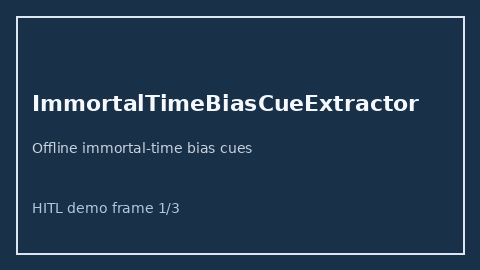

# ImmortalTimeBiasCueExtractor Guide



Offline cue extractor. Never network I/O. Gap vs Elicit/Consensus/AJE immortal-time bias cue extractors.

Optional later polish via **GPT-5.5 / Claude Sonnet 4.6 / Gemini 3.x / Kimi K2**.

Distinct from `EValueSensitivityCueExtractor / SpilloverInterferenceCueExtractor`.

## Usage

```python
from retrieval.immortal_time_bias_cues import ImmortalTimeBiasCueExtractor

cues = ImmortalTimeBiasCueExtractor().extract(
    [
        {
            "paper_id": "p1",
            "abstract": "We discuss immortal time bias and guarantee-time bias.",
        }
    ]
)
assert cues[0].flagged is True
```
