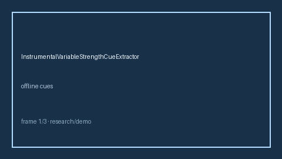

# InstrumentalVariableStrengthCueExtractor Guide



Closes Elicit / Consensus / AJE instrumental-variable strength gaps.

Optional later polish via **GPT-5.5 / Claude Sonnet 4.6 / Gemini 3.x / Kimi K2**.

Distinct from `ConfoundingAdjustmentCueExtractor` and `TransportabilityCueExtractor`.

## Usage

```python
from retrieval.instrumental_variable_strength_cues import InstrumentalVariableStrengthCueExtractor

rows = InstrumentalVariableStrengthCueExtractor().extract(
    [
        {
            "paper_id": "p1",
            "methods": "The first-stage F-statistic suggested a weak instrument.",
        }
    ]
)
print(rows[0].flagged, rows[0].cues)
```

## Safety

Offline patterns only. No HTTP. Humans interpret evidence cues.
