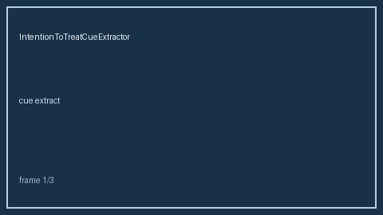

# IntentionToTreatCueExtractor Guide



`IntentionToTreatCueExtractor` Extract offline ITT/mITT/per-protocol analysis cues; fills an Elicit/Consensus/Cochrane/PaperQA ITT-analysis gap (distinct from BlindingStatusCueExtractor / RiskOfBiasCueExtractor)

Never calls the network. Optional later narrative: **GPT-5.5 / Claude Sonnet 4.6 / Gemini 3.x / Kimi K2**.

## Usage

```python
from retrieval.intention_to_treat_cues import IntentionToTreatCueExtractor

rows = IntentionToTreatCueExtractor().extract([{"paper_id": "p1", "abstract": "..."}])
print(rows[0].flagged, rows[0].cues)
```
