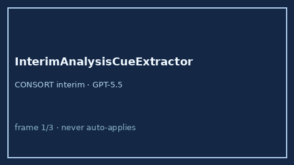

# InterimAnalysisCueExtractor Guide



Offline evidence-methods cue extractor for interim analysis / DSMB / early
stopping. Never network I/O. Gap vs Elicit / Consensus / CONSORT.

Optional later polish via **GPT-5.5 / Claude Sonnet 4.6 / Gemini 3.x / Kimi K2**.

Distinct from `MultiplicityAdjustmentCueExtractor` and `ProtocolDeviationCueExtractor`.

## Usage

```python
from retrieval.interim_analysis_cues import InterimAnalysisCueExtractor

rows = InterimAnalysisCueExtractor().extract(
    [{"paper_id": "p1", "abstract": "A pre-specified interim analysis was planned."}]
)
assert rows[0].flagged is True
```
