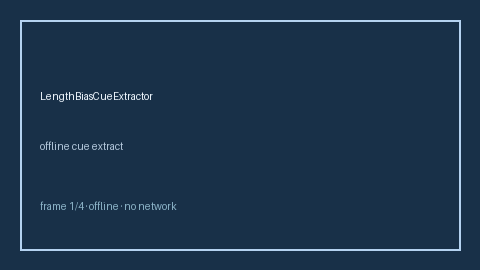

# LengthBiasCueExtractor Guide



Offline deterministic cue extractor. Never calls the network.
Closes gaps vs Elicit/Consensus/AJE length-bias cue extractors.

Optional later narrative via **GPT-5.5 / Claude Sonnet 4.6 / Gemini 3.x / Kimi K2**.

## Usage

```python
from retrieval.length_bias_cues import LengthBiasCueExtractor

cues = LengthBiasCueExtractor().extract(
    [
        {
            "paper_id": "p1",
            "abstract": "Screening studies can suffer from length-bias favoring indolent cases.",
        }
    ]
)
print(cues[0].flagged, cues[0].cue_kind)
```

## Safety

Advisory cues only. Humans decide relevance. See `SAFETY.md`.
