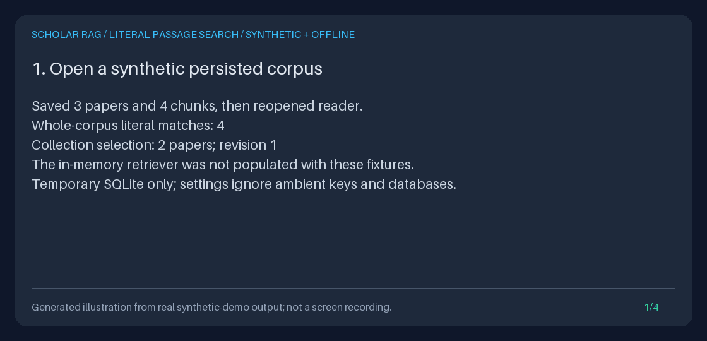

# Literal Passage Search over the Current Local Corpus

`POST /research/search` finds an **exact, case-sensitive Unicode substring** in
persisted chunk text. Use it to locate a remembered phrase across papers,
including late occurrences in longer library-provided chunks that exceed the
standard API's 800-character ingestion chunk size or an inspection prefix.
Each chunk is searched independently: search never concatenates API chunks,
and a phrase split across chunk boundaries may not match.
It returns the first occurrence in each matching chunk, not a relevance score,
generated answer, or scientific-support judgment.

The standalone Python reader is `storage.literal_search.SQLiteLiteralSearch`.
Both interfaces read the existing SQLite corpus directly with parameterized
`instr`/`substr`; neither calls hash/BM25 retrieval, reranking, live/fake
generation, or agent-event persistence. No FTS index, schema migration,
backfill, provider setting, or dependency is added.



This is a generated illustration of asserted, saved demo output, **not a
browser recording or fabricated research UI**. The four 1120-by-540 frames
display measured API/Python results from synthetic local fixtures.

## Choose the right inspection path

| Need | Interface |
| --- | --- |
| Find exact wording in current stored chunks across papers | `POST /research/search` |
| Discover document IDs by title/source and inspect counts | [`GET /documents`](DOCUMENT_CATALOG_GUIDE.md) |
| Browse a known paper's current stored chunk prefixes | [`GET /documents/{document_id:path}/chunks`](DOCUMENT_CHUNKS_GUIDE.md) |
| See ranked context that an agent would prepare | [`POST /retrieve`](RETRIEVAL_PREVIEW_GUIDE.md) |
| Compare retrieved passages question by question, paper by paper | [Research worksheets](RESEARCH_WORKSHEET_GUIDE.md) |
| Preserve the evidence actually used by a completed answer | [Frozen evidence exports](EVIDENCE_EXPORT_GUIDE.md) |

Literal search has no token boundaries, stemming, synonyms, language-model
interpretation, regular expressions, or FTS query language. `%`, `_`, quotes,
and backslashes are ordinary characters. For example, `100%_proof\path`
matches that exact sequence, not a SQL wildcard expression.

Leading/trailing query whitespace is preserved if the query is not entirely
blank. Case and Unicode normalization are not changed: `café` and a spelling
using `e` plus a combining accent are different sequences. An empty result
means no matching stored chunk was returned in this scope/page, **not** that
the literature lacks evidence.

## Run and reproduce the offline demonstration

From an installed checkout, with the existing dev extras:

```bash
uv sync --extra dev
DEMO_ROOT="$(mktemp -d "${TMPDIR:-/tmp}/scholar-literal-demo.XXXXXX")"
uv run python -m scripts.demo_literal_search --output-dir "$DEMO_ROOT/results"
uv run python -m scripts.create_literal_search_gif \
  --transcript "$DEMO_ROOT/results/transcript.txt" \
  --output "$DEMO_ROOT/literal-search.gif"
cat "$DEMO_ROOT/results/checks.json"
```

The setup saves three synthetic papers, four chunks, and a two-paper collection
in a new temporary database. It deliberately does not populate the in-memory
retriever with those fixtures. It then measures whole-corpus search, scoped
pagination, a late phrase, literal metacharacters, a case-sensitive empty
result, changed-query cursor rejection, direct Python parity, and reader
restart. Search-time guards reject network/model/retrieval/writing calls;
database hashes and event counts must remain unchanged.

The temporary database is removed. Only your explicitly requested JSON,
transcript, and GIF outputs remain. Environment, dotenv, secret-file settings,
provider keys, and the user's configured database are ignored. Setup writes
synthetic fixtures; **search does not write them**. Existing output directories,
files, and symlinks are refused instead of overwritten.

Inspect the actual response artifacts, rather than treating the GIF as evidence:

| Artifact | Measured content |
| --- | --- |
| `collection.json` | Synthetic selection and its actual collection ID |
| `whole-corpus.json` | Four matching chunks before narrowing scope |
| `page-1.json`, `page-2.json`, `page-3.json` | Three selected chunks in exclusive ID order |
| `literal.json`, `empty.json` | Exact punctuation matches and a case-sensitive empty result |
| `mismatch.json` | HTTP 422 for reusing a cursor with a changed query |
| `python.json`, `restarted.json` | Byte-identical first-page representations |
| `checks.json`, `transcript.txt` | Measured counts, spans, response size, and side-effect checks |

The renderer uses existing Pillow tooling, checks transcript shape and clipping,
and produces four distinct frames lasting 3.5 seconds each. Re-rendering the
same transcript with the same Pillow/font version produces identical GIF bytes.
Collection IDs are randomly assigned at setup; they are not fabricated fixed
identities. Their values do not appear in the illustrated transcript.

## HTTP: start a deliberately isolated offline API

In one terminal:

```bash
DEMO_DATABASE="$(mktemp -d "${TMPDIR:-/tmp}/scholar-literal-api.XXXXXX")/corpus.sqlite3"
export DEMO_DATABASE
uv run python - <<'PY'
import os
from pathlib import Path
import uvicorn
from api.application import create_app
from scripts.demo_evidence_export import offline_settings

uvicorn.run(
    create_app(offline_settings(Path(os.environ["DEMO_DATABASE"]))),
    host="127.0.0.1",
    port=8000,
)
PY
```

The ordinary app factory still initializes its existing stores and in-memory
retriever at startup. Literal search itself bypasses them; use the standalone
reader below when you require **no app initialization or index rebuilding**.
No provider or fake generator is invoked by these examples.

In another terminal, seed a permitted synthetic note, then search it:

```bash
curl --fail-with-body http://127.0.0.1:8000/ingest/text \
  -H 'Content-Type: application/json' \
  -d '{"title":"Synthetic literal example","source":"synthetic:literal-guide","text":"This synthetic note contains the exact phrase. Exact wording is not scientific support."}'

curl --fail-with-body http://127.0.0.1:8000/research/search \
  -H 'Content-Type: application/json' \
  -d '{"query":"exact phrase","limit":20}'
```

Use `GET /documents` to recover exact IDs rather than guessing ingestion hashes.
This complete HTTPX example discovers the just-ingested note, creates a named
selection, and follows the returned cursor. Run against the fresh API above;
creating the same collection name twice is an existing collection conflict:

```python
import httpx

with httpx.Client(base_url="http://127.0.0.1:8000") as client:
    catalog = client.get("/documents", params={"source": "synthetic:literal-guide"})
    catalog.raise_for_status()
    ids = [item["document_id"] for item in catalog.json()["documents"]]
    assert len(ids) == 1
    created = client.post(
        "/collections", json={"name": "Literal guide selection", "document_ids": ids}
    )
    created.raise_for_status()
    collection_id = created.json()["collection_id"]
    payload = {"query": "exact phrase", "collection_id": collection_id, "limit": 2}
    while True:
        response = client.post("/research/search", json=payload)
        response.raise_for_status()
        page = response.json()
        for match in page["matches"]:
            print(match["document_id"], match["chunk_id"])
            print(match["match_start"], match["match_end"], match["excerpt"])
            print("Inspect current paper chunks:", match["inspection_url"])
        if page["next_cursor"] is None:
            break
        payload["cursor"] = page["next_cursor"]
```

Instead of `collection_id`, send `"document_ids": ids` for an unsaved selection.
Omit both to search the whole current corpus. Never turn an empty selection into
an omitted scope: explicit empty/null scope is rejected to avoid broadening.

## Python: no server, container, settings, or retriever

This runnable example creates only a temporary synthetic corpus, finds a phrase
past character 800, and continues after reopening the read-only reader:

```python
from pathlib import Path
from tempfile import TemporaryDirectory
from retrieval.models import Chunk, Document
from storage.document_store import SQLiteDocumentStore
from storage.literal_search import LiteralSearchRequest, SQLiteLiteralSearch

with TemporaryDirectory() as temporary:
    database = Path(temporary) / "corpus.sqlite3"
    text = "Synthetic context. " * 60 + "exact phrase" + " trailing context."
    SQLiteDocumentStore(database).add_documents(
        [Document(document_id="paper", title="Synthetic", source="local", text="Body")],
        [
            Chunk(
                chunk_id=identifier, document_id="paper", title="Synthetic",
                source="local", text=text,
            )
            for identifier in ("a", "b")
        ],
    )
    before = database.read_bytes()
    first = SQLiteLiteralSearch(database).search(
        LiteralSearchRequest(query="exact phrase", document_ids=["paper"], limit=1)
    )
    match = first.matches[0]
    assert match.match_start > 800
    assert text[match.match_start:match.match_end] == first.query
    assert text[match.excerpt_start:match.excerpt_end] == match.excerpt
    print(first.to_json())
    assert first.next_cursor is not None
    following = SQLiteLiteralSearch(database).search(
        LiteralSearchRequest(
            query="exact phrase", document_ids=["paper"], cursor=first.next_cursor
        )
    )
    assert [item.chunk_id for item in following.matches] == ["b"]
    assert following.next_cursor is None
    assert database.read_bytes() == before
```

For an existing corpus, construct `SQLiteLiteralSearch` with its exact path.
It resolves and escapes the file URI and opens SQLite with `mode=ro`. Missing
storage is an error, not a newly created empty database. UTF-8, UTF-16LE, and
UTF-16BE SQLite databases are supported; returned JSON is always UTF-8.
Collections are read from that same database in the same transaction, without
constructing the schema-initializing collection store.

## Request, response, and fixed bounds

| Field/control | Contract |
| --- | --- |
| `query` | Required strict string, 1-200 Unicode characters, nonblank and valid UTF-8 |
| `document_ids` | Optional existing shared validator: 1-100 supplied IDs, each 1-128 characters, outer whitespace trimmed, duplicates removed |
| `collection_id` | Optional existing `col_` plus 32 lowercase hex characters; mutually exclusive with `document_ids` |
| `limit` | Strict integer 1-50, default 20; booleans, floats, and numeric strings fail |
| `cursor` | Omit on the first request; otherwise the exact returned canonical cursor, at most 4096 characters |
| Unknown request fields | Rejected; explicit null options are rejected, not treated as omission |
| Matching/returned rows | At most `limit + 1` bounded result projections; the extra row decides continuation and is validated |
| Excerpt | At most 800 characters, starting up to 120 characters before the first match |
| Labels | Chunk title prefix at most 300 characters; source prefix at most 512; each has a truncation flag |
| Identities | Exact document ID at most 128 characters and chunk ID at most 256; never truncated |
| Stored passage scan | At most 4,194,304 bytes per encountered passage, in the database's encoding |
| Serialized result | At most 262,144 UTF-8 bytes, including escaping, scope, query, cursor, and provenance |
| Scan deadline | Cooperative five-second SQLite progress deadline; lock waiting also has a five-second timeout |

Both Python `search()` and `to_json()` enforce the serialized limit; the HTTP
body is that exact representation. Request a smaller page after a response-size
error. A label/source prefix is display-only, never an identifier or link target.
No full document body, chunk metadata, score, rank, or fake relevance claim is
included.

Each match includes `match_start`/`match_end`, `excerpt_start`/`excerpt_end`,
`excerpt_truncated_before`/`excerpt_truncated_after`, and `text_characters`.
Offsets are **zero-based, half-open Unicode code-point positions in full
current chunk text**, not UTF-8 bytes, grapheme clusters, PDF coordinates, or
indices into the excerpt. Combining characters and astral characters count as
Python string characters. The first occurrence is returned once per chunk,
even if it repeats; overlapping ingestion chunks can repeat the same passage.

`inspection_url` is the existing current-paper chunk inspection endpoint,
not a frozen permalink or a deep link to a particular chunk/page. Follow its
pagination to locate the returned `chunk_id`; that endpoint exposes a bounded
prefix, so a very late match may only be visible in the search excerpt.
IDs containing `.` or `..` path segments have `inspection_url: null` because
clients may normalize them; exact IDs still work through Python/search scope.

## Scope and cursor semantics

Explicit unknown IDs match nothing and remain in the returned normalized
selection, consistent with retrieval scope. Mixing known and unknown IDs never
adds other papers. A missing collection is 404; corrupt collections or missing
members are 409. A collection includes all saved members, **not just screened
include decisions**. To use screening, explicitly pass its reviewed included
IDs instead of replacing an empty included selection with a whole collection.

Results use SQLite binary document-ID order, then binary chunk-ID order.
Pagination is an exclusive keyset, not an offset or relevance ranking. Cursors
bind the exact query, sorted deduplicated document selection, selection kind,
and collection ID/revision. Equivalent reordered explicit IDs work; changing
the query, scope, or collection revision fails. Renaming a collection increments
its revision and invalidates old cursors. Page size may change.

One request sees one SQLite read snapshot for collection membership, document
existence, and chunks. **There is no snapshot across page requests.** Repeating
a cursor against unchanged data is deterministic. Reingested text or newly
inserted chunks ahead of the cursor can appear; insertions behind it are not
revisited. Deleting the boundary row does not break continuation. Restart from
the first page to inspect a changed corpus. Never reuse a cursor after moving
the database to a different encoding.

Cursors are canonical encoded data with a SHA-256 query/scope binding, **not
signed authorization tokens**. They contain IDs and a digest and may be
sensitive. They do not authorize access or freeze evidence.

## Errors, malformed storage, and privacy

| HTTP | Code | Action |
| --- | --- | --- |
| 422 | `invalid_search_request` | Fix JSON/UTF-8, query, scope, limit, or fields; unused options must be omitted |
| 422 | `invalid_search_cursor` | Use the returned cursor with the same query/scope or start a new search |
| 404 | `collection_not_found` | Select an existing collection |
| 409 | `invalid_collection_record`, `collection_documents_missing` | Repair/reselect the collection; no whole-corpus fallback occurs |
| 409 | `invalid_chunk_record` | Inspect malformed, orphaned, or unsupported projected evidence/provenance |
| 413 | `search_text_read_limit` | An encountered stored chunk is too large; narrow scope or repair ingestion deliberately |
| 413 | `search_response_too_large` | Reduce `limit`; there is no silently shortened success |
| 503 | `search_storage_unavailable` | Check the configured file, tables, database validity, and permissions |
| 504 | `search_timeout` | Narrow the paper selection; no partial results were returned |

Standalone invalid request models raise Pydantic `ValidationError`; cursor,
limit, and storage failures use `LiteralSearchError`. Existing
`DocumentChunksError` and `CollectionError` retain their codes. HTTP validation
errors and operational diagnostics are fixed, sanitized messages; raw queries,
payloads, SQL exceptions, and private paths are not echoed in errors or logs.

SQLite `length`/text `substr` terminate at NUL. Therefore an encountered
NUL-bearing passage is explicitly unsupported (`invalid_chunk_record`), rather
than returning false offsets or a silently clipped successful excerpt.
Other Unicode text and NULs in opaque IDs/display labels are preserved. Invalid
types/orphan provenance and malformed projected text fail even in lookahead.
SQLite also accepts malformed encoded TEXT. A connection-local validation
function strictly decodes one size-bounded eligible passage at a time, without
retaining the corpus, so corrupt searched text cannot become a false empty
success or invented Unicode offsets outside the excerpt. Oversized passages
are rejected before that function receives them. This is not a whole-database
integrity audit: unreturned label suffixes, arbitrary metadata, and pages
outside this request are not fully validated.

Native substring search can scan all eligible chunks, particularly for an
absent phrase; no FTS index is created. Scope and the exclusive cursor filter
before the result limit. Result projections are byte/character bounded; Unicode
validation transiently decodes one passage of at most 4 MiB, not the whole
corpus. Matching and excerpt extraction remain SQLite `instr`/`substr`.
A cooperative deadline does not
preempt every individual SQLite function call or provide a process-level
resource guarantee. Keep this local/trusted, not a public large-corpus service.

Successful responses and handled errors set `Cache-Control: no-store` and
`X-Content-Type-Options: nosniff`. These headers are **not authentication**.
Queries, excerpts, identifiers, titles, source labels, cursors, and saved demo
outputs can be sensitive. The service has no tenant isolation. Keep it on
loopback; do not render source text as trusted HTML, execute it, or send it to a
provider automatically. Caller files, reverse proxies, and application-level
logging can retain copies even though this reader writes no corpus, collection,
run, annotation, screening, or event data.

## Design inspiration and current provider documentation

Public references checked **2026-10-03 America/Los_Angeles**:

| Project | Inspiration, not a dependency or parity claim |
| --- | --- |
| [PaperQA](https://github.com/Future-House/paper-qa) | Its usable local full-text search motivates finding source wording before answering; 9,288 stars observed at the check. |
| [Open Notebook](https://github.com/lfnovo/open-notebook) | Full-text/vector search across research content motivates a distinct discover-and-inspect step; 39,762 stars observed at the check. |

This original implementation is a narrower, model-free SQLite literal search,
not either project's retrieval engine, UI, semantic search, citation quality,
or scientific-validation capability. No source was copied, no package added,
and popularity counts are dated observations rather than quality evidence.
The actual stack remains custom Observe -> Decide -> Act orchestration,
Pydantic, FastAPI, HTTPX, and SQLite, **not LangGraph**.

The four official model catalogs were also rechecked on
**2026-10-04 America/Los_Angeles**:
[OpenAI](https://developers.openai.com/api/docs/models.md) lists `gpt-6-astra`,
`gpt-6.1-sol`, and `gpt-6-luna`;
[Anthropic](https://platform.claude.com/docs/en/models/overview) lists
`claude-fable-5-1`, `claude-opus-5-5`, and `claude-sonnet-5-5`, with a general
Opus recommendation;
[Google](https://ai.google.dev/gemini-api/docs/latest-model) lists
`gemini-3.8-flash` as GA; and
[Kimi](https://platform.kimi.ai/docs/models) lists `kimi-k3`, with K2.5 and
`moonshot-v1` discontinued on August 31.

This catalog-only refresh does not alter selected defaults, redate migration
checks, run paid/live inference, or establish account entitlement. Literal
search does not use these providers. See the separately dated migration and
adapter contracts in [Provider models](PROVIDER_MODELS_GUIDE.md), along with
[configuration](../../CONFIGURATION.md), [architecture](../../ARCHITECTURE.md),
and [safety](../../SAFETY.md).
