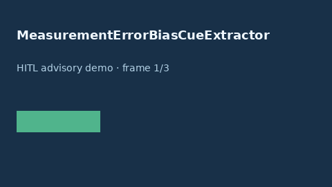

# MeasurementErrorBiasCueExtractor Guide



Offline cue extractor. Never network I/O.

Gap vs Elicit/Consensus/AJE measurement-error bias cue extractors.

Optional polish via **GPT-5.5 / Claude Sonnet 4.6 / Gemini 3.x / Kimi K2**.

## Usage

```python
from retrieval.measurement_error_bias_cues import MeasurementErrorBiasCueExtractor

cues = MeasurementErrorBiasCueExtractor().extract([{"paper_id": "p1", "abstract": "..."}])
print(cues[0].flagged)
```

## Safety

Advisory cues only. Humans decide evidence grading.
