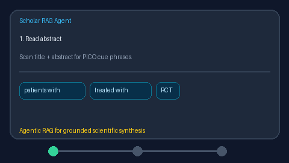

# Method Extract Card Guide



`MethodExtractCard` extracts a deterministic **PICO/methods card** from paper
abstracts (and optional titles): Population, Intervention, Comparison, Outcome,
and study-design cues.

Fills an Elicit / Consensus / SciSpace methods-extraction gap with offline
heuristics (no LLM call). Optional later enrichment can use GPT-5.5 /
Claude Sonnet 4.6 / Gemini 3.x / Kimi K2.

## Usage

```python
from retrieval.method_extract_card import MethodExtractCard

extractor = MethodExtractCard()
card = extractor.extract(
    "In a randomized controlled trial, patients with sepsis received "
    "hydrocortisone compared to placebo. The primary outcome was 28-day mortality.",
    title="Steroids in sepsis",
)
print(card.population, card.intervention, card.comparison, card.outcome)
print(card.study_design, card.confidence)
```

Empty abstracts yield empty fields and `confidence=0.0`. Confidence is the
fraction of the five card fields that are non-empty.
