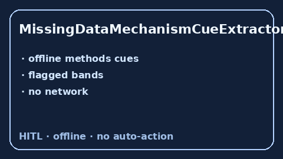

# MissingDataMechanismCueExtractor Guide



Offline cue extractor. Never network. Closes Elicit / Consensus / CONSORT missing-data mechanism gaps.

Optional polish via **GPT-5.5 / Claude Sonnet 4.6 / Gemini 3.x / Kimi K2**.

Distinct from `AttritionRateCueExtractor / IntentionToTreatCueExtractor`.

## Usage

```python
from retrieval.missing_data_mechanism_cues import MissingDataMechanismCueExtractor

rows = MissingDataMechanismCueExtractor().extract(
    [{"paper_id": "p1", "methods": "Outcomes were assumed missing at random (MAR)."}]
)
print(rows[0].flagged, rows[0].cues)
```
