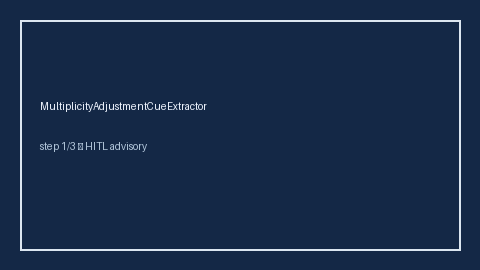

# MultiplicityAdjustmentCueExtractor Guide



Offline evidence cue extractor. Never calls the network.

Optional later narrative via **GPT-5.5 / Claude Sonnet 4.6 / Gemini 3.x / Kimi K2**.

Distinct from PValueHintExtractor and SubgroupAnalysisCueExtractor.

## Usage

```python
from retrieval.multiplicity_adjustment_cues import MultiplicityAdjustmentCueExtractor

rows = MultiplicityAdjustmentCueExtractor().extract(
    [{"paper_id": "p1", "abstract": "P-values used Bonferroni correction."}]
)
assert rows[0].flagged is True
```
