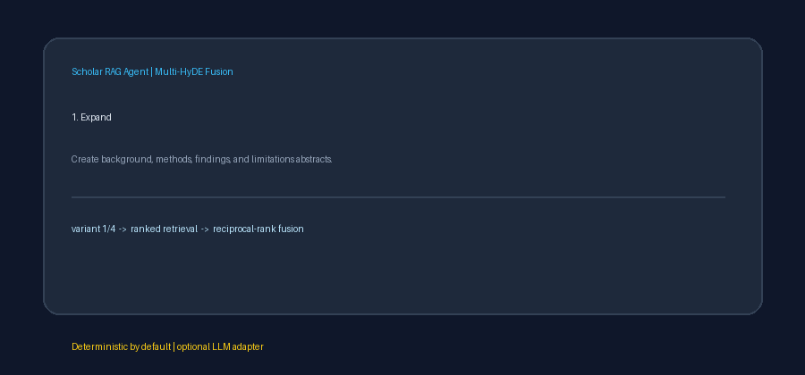

# Multi-HyDE Fusion Guide



`MultiHydeFusion` searches several hypothetical scientific abstracts instead of
depending on one synthetic answer. The default path is local and deterministic;
an optional provider adapter can generate the abstracts with GPT-5.5, Claude
Sonnet 4.6, Gemini 3.x, or Kimi K2.

## Pipeline

1. Normalize the research query.
2. Generate `num_hypotheses` abstracts in a stable background, methods,
   findings, and limitations perspective order.
3. Pair the original query with each abstract and send every expansion to an
   asynchronous retriever. Dense retrievers embed each expanded query normally;
   sparse or hybrid retrievers can use the same contract.
4. Label each ranked list with its hypothesis number.
5. Fuse duplicate chunk ids with the shared reciprocal-rank-fusion
   implementation.

Repeated perspectives remain distinct when more than four hypotheses are
requested because each abstract includes its stable variant number.

## Example

```python
from retrieval.dense import DenseRetriever
from retrieval.multi_hyde_fusion import MultiHydeFusion

dense = DenseRetriever()
dense.add_chunks(chunks)

fusion = MultiHydeFusion(
    dense,
    num_hypotheses=4,
    rank_constant=60,
)
results = await fusion.retrieve(
    "How do graph neural networks improve molecular property prediction?",
    limit=8,
)
```

The returned results use `retriever="rrf"`. Their `path` lists the
`multi_hyde:N` variants that retrieved each chunk, which makes cross-hypothesis
support auditable.

## Optional LLM generation

Pass any `BaseLLMAdapter` to `llm=`. One speed-class request is issued per
perspective. A blank provider response falls back to the corresponding local
template, so every configured variant still participates. Provider-side
sampling controls whether the optional path itself is reproducible; the default
template path requires no model, network, or embedding dependency.

## Bounds and edge cases

- `num_hypotheses` and `rank_constant` must be positive integers.
- A blank query returns no expansions and makes no retrieval calls.
- A non-positive retrieval `limit` returns an empty list.
- Each underlying call is limited before RRF, and the final list is limited
  again.
- Input results are copied before provenance labels are attached.
