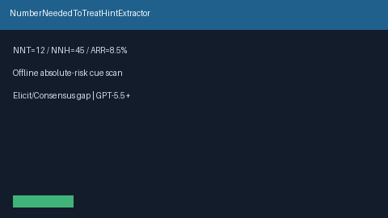

# Number Needed to Treat Hint Extractor Guide



`NumberNeededToTreatHintExtractor` scans title / abstract / results text for
offline NNT / NNH / ARR cues (`number needed to treat was 12`, `NNT = 20`,
`NNH = 45`, `absolute risk reduction ARR: 8.5%`). It returns advisory
metric + numeric value pairs with the matched cue string. It never calls
the network.

Distinct from `EffectSizeHintExtractor` (Cohen's d / OR / HR / RR / AUC),
`SampleSizeHintExtractor` (N= sample-size integers), and
`PValueHintExtractor` (p-value cues). Fills an Elicit / Consensus /
SciSpace / PaperQA NNT / NNH / ARR surfacing gap with deterministic
heuristics. Optional later narrative can use GPT-5.5 / Claude Sonnet 4.6 /
Gemini 3.x / Kimi K2.

## Usage

```python
from retrieval.nnt_hint import NumberNeededToTreatHintExtractor

hints = NumberNeededToTreatHintExtractor().extract(
    [
        {
            "paper_id": "p1",
            "abstract": "The number needed to treat was 12 for the primary endpoint.",
        },
        {
            "paper_id": "clear",
            "abstract": "We study transformers without absolute-risk reporting.",
        },
    ]
)
for hint in hints:
    print(hint.paper_id, hint.metric, hint.value, hint.matched_cue)
```

When multiple cues match, NNT is preferred over NNH over ARR. Empty paper
lists return an empty tuple. Inputs are not mutated.
