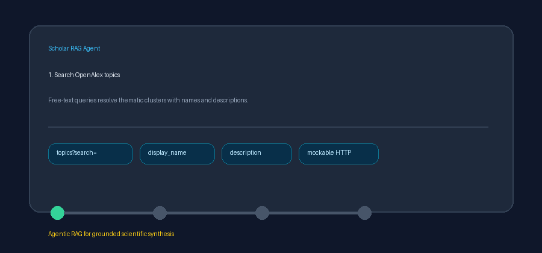

# OpenAlex Topics Source Guide



Use this guide when wiring OpenAlex topics into **scholar-rag-agent**. The agent
can route downstream synthesis through GPT-5.5 / Claude Sonnet 4.6 / Gemini 3.x /
Kimi K2 when enabled, but the topics connector itself is deterministic JSON; no
LLM is required to discover research themes.

## Why OpenAlex topics

OpenAlex clusters scholarly works into research topics with human-readable
names, descriptions, and coverage statistics. Alongside OpenAlex works,
Semantic Scholar, and Crossref, topic search helps RAG pipelines map a broad
question to the right thematic neighborhood before drilling into papers.

Free-text topic discovery:

```text
GET https://api.openalex.org/topics?search=machine+learning&per-page=5
```

When the query is an OpenAlex topic id (`T####`), the connector resolves the
topic directly and samples representative works via:

```text
GET https://api.openalex.org/topics/T11948
GET https://api.openalex.org/works?filter=topics.id:T11948&per-page=5
```

Pass `OpenAlexTopicsConnector(mailto=...)` or set `OPENALEX_MAILTO` (falling
back to `UNPAYWALL_EMAIL`) to join OpenAlex's polite pool. Blank queries and
non-positive `max_results` return no documents and do not issue HTTP requests.
Unavailable API responses are treated as empty results.

## What you get

| Field | Source |
|---|---|
| `title` | `display_name` |
| `text` | `description`, else a synthesized topic descriptor |
| `source` | OpenAlex topic `id` |
| `metadata.source_type` | `"openalex_topics"` |
| `metadata.topic_id` | Bare topic id (for example `T11948`) |
| `metadata.description` | Topic `description` |
| `metadata.works_count` | `works_count` |
| `metadata.subfield` | `subfield.display_name` |
| `metadata.field` | `field.display_name` |
| `metadata.domain` | `domain.display_name` |
| `metadata.sample_work_titles` | Semicolon-joined titles from filtered works when the query is a topic id |

## Example

```python
import asyncio

from ingestion.openalex_topics import OpenAlexTopicsConnector

documents = asyncio.run(
    OpenAlexTopicsConnector(mailto="dev@example.org").search(
        "machine learning",
        max_results=5,
    )
)
for document in documents:
    print(document.metadata["works_count"], document.title)
```

Topic id lookup:

```python
documents = asyncio.run(OpenAlexTopicsConnector().search("T11948", max_results=3))
```

## Safety notes

- Topic descriptions are OpenAlex catalog metadata — verify against primary
  literature before treating them as authoritative domain definitions.
- Untitled topic records are skipped rather than raised.
- Prefer frontier models for downstream synthesis over topic summaries:
  **GPT-5.5**, **Claude Sonnet 4.6**, **Gemini 3.x**, **Kimi K2**.
