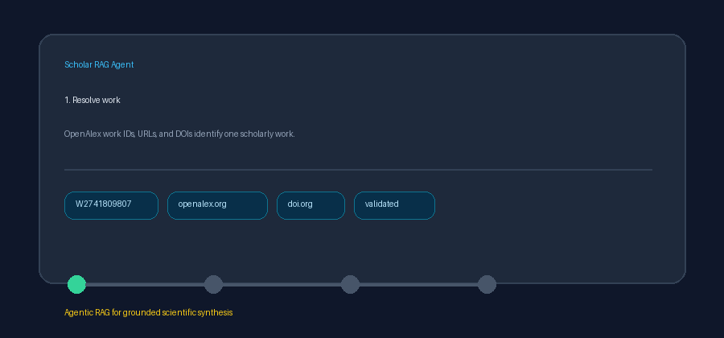

# OpenAlex Works N-grams Source Guide



Use this guide to retrieve statistically salient phrases for one OpenAlex work.
Discovery uses deterministic HTTP against the public OpenAlex API; optional
downstream synthesis can use GPT-5.5 / Claude Sonnet 4.6 / Gemini 3.x / Kimi K2.

## Why work n-grams

OpenAlex n-grams expose recurring phrases and frequencies even when a complete
abstract is unavailable. This connector is distinct from `openalex.py`, which
normalizes full work records and reconstructed abstracts.

## Usage

```python
from ingestion.openalex_works_ngrams import OpenAlexWorksNgramsConnector

# Bare and URL-shaped OpenAlex work ids
docs = await OpenAlexWorksNgramsConnector(mailto="dev@example.org").search(
    "W2741809807",
    max_results=10,
)

# Bare DOI, doi: DOI, and doi.org URL forms are accepted
docs = await OpenAlexWorksNgramsConnector().search(
    "https://doi.org/10.1000/rag",
    max_results=10,
)
```

Each accepted query calls
`GET https://api.openalex.org/works/{encoded_identifier}/ngrams`.

## What you get

| Field | Source |
|---|---|
| `title` | `OpenAlex n-gram: {phrase}` |
| `text` | N-gram phrase |
| `source` | OpenAlex n-grams endpoint |
| `metadata.source_type` | `openalex_works_ngrams` |
| `metadata.openalex_work_id` | Bare `W####` when queried |
| `metadata.doi` | Normalized DOI when queried |
| `metadata.ngram_tokens` | Number of tokens in the phrase |
| `metadata.ngram_count` | Phrase occurrence count |
| `metadata.term_frequency` | OpenAlex term-frequency score |

## Safety notes

- Public OpenAlex API only; optional `mailto` routes polite-pool traffic.
- Only work IDs/URLs and DOI identifiers are accepted.
- Response size is bounded by `max_results`.
- Blank input, non-positive limits, and unavailable responses return an empty list.
