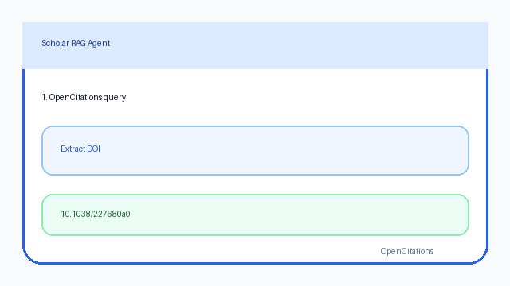

# OpenCitations Source Guide



Use this guide when wiring OpenCitations into **scholar-rag-agent**. The agent
can route enrichment through GPT-5.5 / Claude Sonnet 4.6 / Gemini 2.5 / Kimi K2
when enabled, but the OpenCitations connector itself is deterministic JSON; no
LLM required to resolve DOI metadata.

## Why OpenCitations

OpenCitations provides open bibliographic metadata and citation data for
scholarly works. Alongside Crossref, DataCite, OpenAlex, and Semantic Scholar it
adds transparent citation-count provenance from an open infrastructure source.

The probed Meta search endpoints returned `404 No API operation found`:

```
GET https://api.opencitations.net/meta/v1/search?q=graph+retrieval
GET https://api.opencitations.net/meta/v1/search?text=graph+retrieval
```

This connector is therefore DOI-centric. It accepts free text, extracts DOI
identifiers, and fetches metadata plus best-effort counts:

```
GET https://api.opencitations.net/meta/v1/metadata/doi:10.1038/227680a0
GET https://api.opencitations.net/index/v2/citation-count/doi:10.1038/227680a0
GET https://api.opencitations.net/index/v2/reference-count/doi:10.1038/227680a0
```

OpenCitations recommends an access token for applications. Pass
`OpenCitationsConnector(access_token=...)` or set `OPENCITATIONS_ACCESS_TOKEN`;
public metadata can still be fetched without a token.

## What you get

| Field | Source |
|---|---|
| `title` | `title` |
| `text` | `By authors in venue [type] (year)` descriptor |
| `source` | `https://doi.org/{doi}`, else title |
| `metadata.doi` | DOI extracted from `id` |
| `metadata.year` | Leading four digits of `pub_date` |
| `metadata.authors` | Semicolon-split `author`, with OpenCitations IDs removed |
| `metadata.venue` | `venue`, with bracketed IDs removed |
| `metadata.publication_date` | `pub_date` |
| `metadata.type` | `type` |
| `metadata.citation_count` | Index v2 incoming citation count when available |
| `metadata.reference_count` | Index v2 outgoing reference count when available |
| `metadata.identifiers` | Raw OpenCitations identifier string |
| `metadata.source_type` | `"opencitations"` |

## Example

```python
import asyncio

from ingestion.opencitations import OpenCitationsConnector

documents = asyncio.run(
    OpenCitationsConnector().search("https://doi.org/10.1038/227680a0", max_results=1)
)
for document in documents:
    print(document.metadata["doi"], document.metadata["citation_count"], document.title)
```

## Safety notes

- Blank queries, non-positive `max_results`, and queries without DOI identifiers
  short-circuit with no HTTP call.
- Count lookups are best-effort; slow or unavailable Index calls leave count
  fields empty while preserving the Meta metadata document.
- Records without a title are skipped rather than raising.
