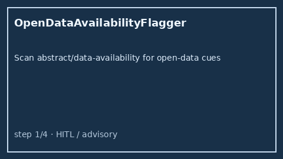

# Open Data Availability Flagger Guide



`OpenDataAvailabilityFlagger` scans title / abstract / data-availability /
supplementary text for offline open-data cues (`data available`, `open data`,
Zenodo, OSF/osf.io, Dryad, Figshare, `github.com/org/repo`, `supplementary
data`). It returns advisory flags with reasons and matched cue strings. It
never calls the network.

Distinct from `CodeAvailabilityBooster` (code-host / source-code score
boosting), `FundingDisclosureFlagger` (funder cues), and
`PreregistrationFlagDetector` (registry / preregistration cues). Fills an
Elicit / Consensus / SciSpace / PaperQA open-data-availability surfacing gap
with deterministic heuristics. Optional later narrative can use GPT-5.5 /
Claude Sonnet 4.6 / Gemini 3.x / Kimi K2.

## Usage

```python
from retrieval.open_data_availability import OpenDataAvailabilityFlagger

flags = OpenDataAvailabilityFlagger().flag(
    [
        {
            "paper_id": "p1",
            "abstract": "Data available on Zenodo; see also supplementary data.",
        },
        {
            "paper_id": "clear",
            "abstract": "We study transformers without sharing underlying datasets.",
        },
    ]
)
for row in flags:
    print(row.paper_id, row.flagged, row.matched_cues)
```

Empty paper lists return an empty tuple. Inputs are not mutated.
