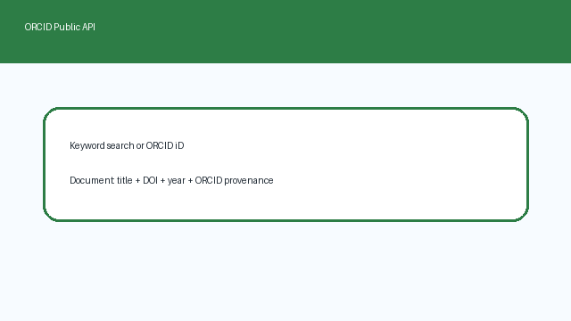

# ORCID Source Guide



Use this guide when wiring ORCID into **scholar-rag-agent**. The agent can route
enrichment through GPT-5.5 / Claude Sonnet 4.6 / Gemini 2.5 / Kimi K2 when
enabled, but the ORCID connector itself is deterministic JSON - no LLM required
to list public ORCID work summaries.

## Why ORCID

ORCID provides persistent researcher identifiers and author-maintained public
record metadata. Alongside paper-first indexes such as OpenAlex, PubMed,
Crossref, Semantic Scholar, and NASA ADS, ORCID is useful when you know an
author's ORCID iD or want to discover public records tied to a topic, person, or
identifier.

Public profile search and works lookup:

```text
GET https://pub.orcid.org/v3.0/expanded-search/?q=retrieval+scholarship&rows=5
Accept: application/json

GET https://pub.orcid.org/v3.0/0000-0002-1825-0097/works
Accept: application/json
```

Keyword queries first call `expanded-search`, then fetch each matching profile's
public `works` endpoint and keep work summaries whose title, journal, type, or
external identifiers match the query tokens. ORCID iD queries such as
`0000-0002-1825-0097` or `https://orcid.org/0000-0002-1825-0097` bypass profile
search and fetch that record's public works directly. `rows` is capped at
**100**.

## What you get

| Field | Source |
|---|---|
| `title` | `work-summary[].title.title.value` |
| `text` | Searchable descriptor with title, profile name, journal, type, DOI, and year |
| `source` | `url.value`, else `https://doi.org/{doi}`, else external-id URL, else ORCID work URL |
| `metadata.orcid` | ORCID iD for the public record |
| `metadata.doi` | First DOI external identifier |
| `metadata.year` | `publication-date.year.value` |
| `metadata.authors` | Profile name from search results, or ORCID iD for direct lookups |
| `metadata.journal` | `journal-title.value` |
| `metadata.work_type` | `type` |
| `metadata.put_code` | ORCID work put-code |
| `metadata.source_type` | `"orcid"` |

## Example

```python
import asyncio

from ingestion.orcid import OrcidConnector

documents = asyncio.run(OrcidConnector().search("retrieval scholarship", max_results=5))
for document in documents:
    print(document.metadata["orcid"], document.metadata["doi"], document.title)

works = asyncio.run(OrcidConnector().search("0000-0002-1825-0097", max_results=5))
```

## Safety notes

- Public unauthenticated search only - no ORCID member token is required.
- Blank queries and non-positive `max_results` short-circuit with no HTTP call.
- Work summaries without a title are skipped rather than raising.
- ORCID records are author-maintained bibliographic summaries and usually do not
  expose abstracts; the connector synthesizes searchable descriptor text for
  retrieval.
