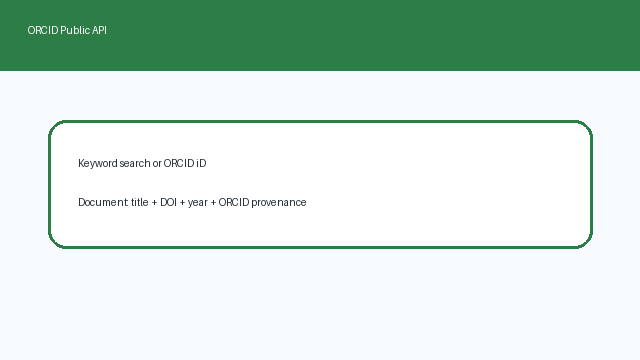

# ORCID Works Filter Source Guide



Use this guide when wiring ORCID year/type-filtered works into
**scholar-rag-agent**. The agent can route downstream synthesis through GPT-5.5 /
Claude Sonnet 4.6 / Gemini 3.x / Kimi K2 when enabled, but this connector itself is
deterministic JSON; no LLM is required to filter public ORCID work summaries.

## Why ORCID works filter

ORCID provides persistent researcher identifiers and author-maintained public
work summaries. This connector builds on the same public API as `orcid.py` and
adds deep filters for publication year and work type so RAG pipelines can keep
only matching works (for example `journal-article` records from `2024`) before
normalizing documents.

Public profile search and works lookup:

```text
GET https://pub.orcid.org/v3.0/expanded-search/?q=retrieval+scholarship&rows=5
Accept: application/json

GET https://pub.orcid.org/v3.0/0000-0002-1825-0097/works
Accept: application/json
```

Filters may be supplied as constructor/search args (`year=`, `work_type=`) or
embedded in the query string:

* `year:2024` / `year=2024`
* work-type tokens such as `journal-article`, `preprint`, `book-chapter`

ORCID iD queries such as `0000-0002-1825-0097 year:2024 journal-article` fetch
that record's public works and apply filters client-side. Keyword queries first
call `expanded-search`, then fetch each matching profile's works and apply
year/type filters plus remaining keyword tokens. Blank queries and non-positive
`max_results` return no documents and do not issue HTTP requests. Unavailable API
responses are treated as empty results.

## What you get

| Field | Source |
|---|---|
| `title` | `work-summary[].title.title.value` |
| `text` | Searchable descriptor with title, profile name, journal, type, DOI, and year |
| `source` | `url.value`, else `https://doi.org/{doi}`, else external-id URL, else ORCID work URL |
| `metadata.source_type` | `"orcid_works_filter"` |
| `metadata.orcid` | ORCID iD for the public record |
| `metadata.doi` | First DOI external identifier |
| `metadata.year` | `publication-date.year.value` |
| `metadata.authors` | Profile name from search results, or ORCID iD for direct lookups |
| `metadata.journal` | `journal-title.value` |
| `metadata.work_type` | `type` |
| `metadata.put_code` | ORCID work put-code |

## Example

```python
import asyncio

from ingestion.orcid_works_filter import OrcidWorksFilterConnector

documents = asyncio.run(
    OrcidWorksFilterConnector().search(
        "retrieval scholarship year:2024 journal-article",
        max_results=5,
    )
)
for document in documents:
    print(document.metadata["year"], document.metadata["work_type"], document.title)

filtered = asyncio.run(
    OrcidWorksFilterConnector(year=2024, work_type="journal-article").search(
        "0000-0002-1825-0097",
        max_results=5,
    )
)
```

## Safety notes

- Public unauthenticated search only — no ORCID member token is required.
- Blank queries and non-positive `max_results` short-circuit with no HTTP call.
- Work summaries without a title are skipped rather than raising.
- ORCID records are author-maintained bibliographic summaries and usually do not
  expose abstracts; the connector synthesizes searchable descriptor text for
  retrieval.
- Prefer frontier models for downstream synthesis: **GPT-5.5**, **Claude Sonnet 4.6**,
  **Gemini 3.x**, **Kimi K2**.
