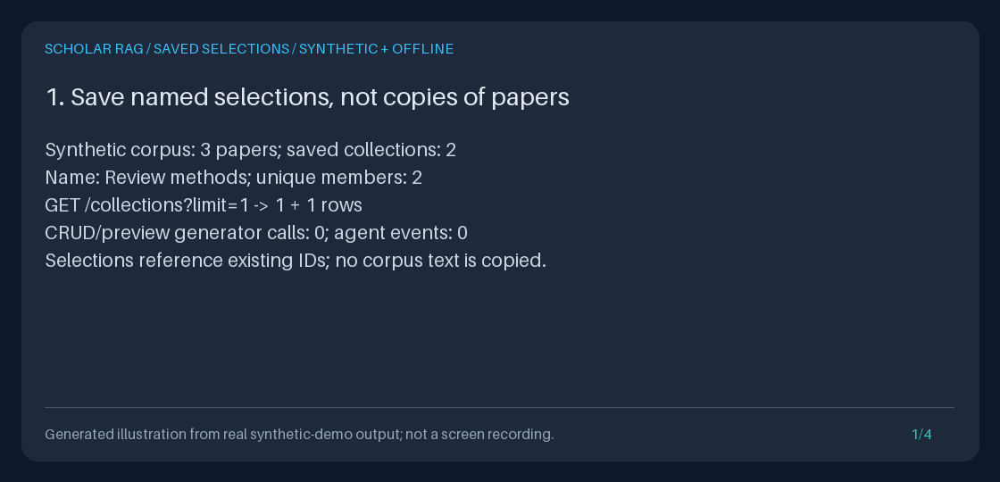

# Saved paper collections

Save a named selection of ingested papers once, recover it after restart, and
send its `collection_id` to **either `POST /retrieve` or `POST /query`**.
Collections are live selections of corpus IDs, not copied documents, archived
source versions, or permissions. Each request resolves the current membership
to immutable `document_ids` before asynchronous agent work begins.



This original generated illustration renders the actual offline demo's measured
API results. It is not a browser UI recording, a live provider demonstration,
or scientific findings.

## Motivation and actual stack

[Dify](https://github.com/langgenius/dify), a popular open-source AI application
platform (156,747 stars observed in the 2026-09-21 research pass), documents
[named knowledge bases](https://docs.dify.ai/en/cloud/use-dify/knowledge/readme.md)
that organize reusable data selections for applications, including research.
Scholar already had a document catalog and one-request `document_ids` scope,
but no persistent named selection. This feature borrows that workflow concept
only: it is original code, not a Dify connector or an implementation of Dify's
ingestion, permissions, or dataset-management platform.

The integrated stack is **FastAPI, Pydantic, HTTPX, SQLite, and a custom
Observe -> Decide -> Act state machine**. Retrieval remains deterministic
lexical hash-vector cosine, BM25, fusion, co-mention graph traversal, and lexical
reranking; there is no LangGraph or learned semantic embedding integration.
Collection operations do not retrieve, call models, or append agent events.
Preview retrieves without any live or fake generator or event writes.

For optional live generation, consult the dated, official-source-linked
[provider guide](PROVIDER_MODELS_GUIDE.md): GPT-6 Astra, Claude Sonnet 5 (selected
default), Gemini 3.8 Flash GA, and Kimi K3. The
[official Claude catalog](https://platform.claude.com/docs/en/models/overview),
rechecked **2026-09-22**, recommends Opus 5.5 for most workloads and Fable 5.1
for demanding reasoning and long-horizon agentic work. Collections make no
model-default changes, availability promises, or inference-quality claims.

## Fresh offline setup

Requirements: Python 3.11+, [uv](https://docs.astral.sh/uv/), and `curl`.
From a fresh checkout:

```bash
git clone https://github.com/Francis1998/scholar-rag-agent.git
cd scholar-rag-agent
uv sync --extra dev
export COLLECTIONS_DB="$(mktemp -d)/papers.sqlite3"
printf 'Keep this path for restart: %s\n' "$COLLECTIONS_DB"
uv run python -c '
import os
from pathlib import Path
import uvicorn
from api.application import create_app
from scripts.demo_evidence_export import offline_settings
uvicorn.run(create_app(offline_settings(Path(os.environ["COLLECTIONS_DB"]))),
            host="127.0.0.1", port=8000)
'
```

This explicit demo-settings factory ignores environment/dotenv/secret-file
settings, including inherited provider keys and unrelated database paths.
Only the explicitly supplied `COLLECTIONS_DB` chooses storage. The server stays
on loopback and uses fake generation. For normal, intentionally
environment-configured deployment, use the [Quickstart](../../QUICKSTART.md).
Dependencies may require downloads during installation; the following demo
operations require no network except local curl requests.

### Ingest, save, inspect, and query

In a second terminal at the repository root, execute this complete block:

```bash
export BASE_URL=http://127.0.0.1:8000
DOC_A="$(curl --fail-with-body --silent --show-error "$BASE_URL/ingest/text" \
  -H 'Content-Type: application/json' \
  -d '{"title":"Synthetic methods","text":"Synthetic data only. GraphRAG retrieval connects passages.","source":"synthetic:collections"}' \
  | uv run python -c 'import json,sys; print(json.load(sys.stdin)["document_id"])')"
DOC_B="$(curl --fail-with-body --silent --show-error "$BASE_URL/ingest/text" \
  -H 'Content-Type: application/json' \
  -d '{"title":"Synthetic comparison","text":"Synthetic data only. GraphRAG retrieval needs human review.","source":"synthetic:collections"}' \
  | uv run python -c 'import json,sys; print(json.load(sys.stdin)["document_id"])')"

# Existing corpora can recover these IDs via GET /documents instead of re-ingesting.
SAVED="$(curl --fail-with-body --silent --show-error "$BASE_URL/collections" \
  -H 'Content-Type: application/json' \
  -d "{\"name\":\"Methods to review\",\"document_ids\":[\"$DOC_A\",\"$DOC_B\"]}")"
COLLECTION_ID="$(printf '%s' "$SAVED" \
  | uv run python -c 'import json,sys; print(json.load(sys.stdin)["collection_id"])')"
REVISION="$(printf '%s' "$SAVED" \
  | uv run python -c 'import json,sys; print(json.load(sys.stdin)["revision"])')"
curl --fail-with-body --silent --show-error "$BASE_URL/collections?limit=20"
curl --fail-with-body --silent --show-error "$BASE_URL/collections/$COLLECTION_ID"
curl --fail-with-body --silent --show-error "$BASE_URL/retrieve" \
  -H 'Content-Type: application/json' \
  -d "{\"query\":\"GraphRAG retrieval\",\"collection_id\":\"$COLLECTION_ID\"}" \
  | uv run python -m json.tool

RUN="$(curl --fail-with-body --silent --show-error "$BASE_URL/query" \
  -H 'Content-Type: application/json' \
  -d "{\"query\":\"GraphRAG retrieval\",\"collection_id\":\"$COLLECTION_ID\"}")"
RUN_ID="$(printf '%s' "$RUN" | uv run python -c '
import json,sys
result = json.load(sys.stdin)["result"]
if result["state"] != "DONE":
    raise RuntimeError(result["error"])
print(result["run_id"])
')"
curl --fail-with-body --silent --show-error "$BASE_URL/runs/$RUN_ID/export" \
  | uv run python -m json.tool
```

Keep this terminal's variables for the next block. To demonstrate persistence,
stop the server with Ctrl-C in its terminal, then repeat **only** the server
command with the same `COLLECTIONS_DB`. Do not run `mktemp` again. Both collection
metadata and corpus indexes are recovered from SQLite. `GET /collections`
rediscovers collection IDs if you lose the shell variables.

### Replace or delete metadata safely

`PUT` replaces the entire name and membership, not a partial patch. Every
successful replacement increments `revision`, including an otherwise identical
replacement. `expected_revision` is mandatory; first read the current detail.

```bash
UPDATED="$(curl --fail-with-body --silent --show-error -X PUT \
  "$BASE_URL/collections/$COLLECTION_ID" -H 'Content-Type: application/json' \
  -d "{\"name\":\"Methods to review\",\"document_ids\":[\"$DOC_A\"],\"expected_revision\":$REVISION}")"
NEW_REVISION="$(printf '%s' "$UPDATED" \
  | uv run python -c 'import json,sys; print(json.load(sys.stdin)["revision"])')"

# Deliberately stale: expect HTTP 409, not a silently lost update.
curl --silent --show-error --write-out '\nHTTP %{http_code}\n' -X PUT \
  "$BASE_URL/collections/$COLLECTION_ID" -H 'Content-Type: application/json' \
  -d "{\"name\":\"Stale edit\",\"document_ids\":[\"$DOC_B\"],\"expected_revision\":$REVISION}"

curl --fail-with-body --silent --show-error "$BASE_URL/retrieve" \
  -H 'Content-Type: application/json' \
  -d "{\"query\":\"GraphRAG retrieval\",\"collection_id\":\"$COLLECTION_ID\"}"
curl --fail-with-body --silent --show-error -X DELETE \
  "$BASE_URL/collections/$COLLECTION_ID?expected_revision=$NEW_REVISION"

# The collection is gone, but documents and original run evidence remain.
curl --fail-with-body --silent --show-error "$BASE_URL/documents"
curl --fail-with-body --silent --show-error "$BASE_URL/runs/$RUN_ID/export?format=markdown"
```

A query using the deleted collection returns HTTP 404 **before** retrieval,
generation, or run-event writes. It never falls back to all documents.
Deleting a collection does not delete its papers, chunks, graph data, or history.

## Python: store usage and unchanged runner signatures

After `uv sync --extra dev`, this complete example needs no server, credentials,
or real papers. The app initializes the corpus first. Standalone callers can
initialize `SQLiteDocumentStore` before `SQLitePaperCollections` instead.

```bash
uv run python - <<'PY'
import asyncio
from pathlib import Path
from tempfile import TemporaryDirectory
from fastapi.testclient import TestClient
from api.application import create_app
from api.dependencies import AppContainer
from scripts.demo_evidence_export import offline_settings
from storage.paper_collections import SQLitePaperCollections

with TemporaryDirectory() as directory:
    path = Path(directory) / "corpus.sqlite3"
    settings = offline_settings(path)
    with TestClient(create_app(settings)) as client:
        response = client.post("/ingest/text", json={
            "title": "Synthetic methods", "source": "synthetic:collections",
            "text": "Synthetic data only. Local retrieval connects passages.",
        })
        response.raise_for_status()
        document_id = response.json()["document_id"]

    store = SQLitePaperCollections(path)
    saved = store.create(name="Methods", document_ids=[document_id, document_id])
    print("Saved members:", len(saved.document_ids))
    restarted = AppContainer(settings)

    async def inspect():
        # Resolve BEFORE awaits; do not put mutable per-request scope on the runner.
        snapshot = store.resolve(saved.collection_id)
        preview = await restarted.runner.preview("retrieval", document_ids=snapshot)
        result = await restarted.runner.run("retrieval", document_ids=snapshot)
        if result.state.value != "DONE":
            raise RuntimeError(result.error)
        print("Selected sources:", len(preview.sources))
        print("State:", result.state.value)
        return result.run_id

    run_id = asyncio.run(inspect())
    before = restarted.evidence_exporter.export(run_id)
    current = store.get(saved.collection_id)
    revised = store.replace(current.collection_id, name="Reviewed",
                            document_ids=[document_id], expected_revision=current.revision)
    print("Revision:", revised.revision)
    store.delete(revised.collection_id, expected_revision=revised.revision)
    print("Surviving history:", restarted.evidence_exporter.export(run_id) == before)
PY
```

`create`, `get`, `list_collections`, `replace`, `delete`, and `resolve` are
synchronous. `resolve` returns a detached immutable tuple; models are frozen.
Invalid Python input raises Pydantic `ValidationError`; operational/domain
failures raise `CollectionError` with `code`, `status_code`, and, only for
unknown creation/replacement members, `missing_document_ids`. `list_collections`
requires a real integer limit, not bool/float/string. No async runner gains a
`collection_id` argument: existing `document_ids=None`/unscoped Python calls
and legacy unscoped test doubles retain their exact calling convention.

## Exact HTTP contract

| Endpoint | Request | Success |
| --- | --- | --- |
| `POST /collections` | `{"name": string, "document_ids": string[]}` | 201 detail, `Location: /collections/{collection_id}` |
| `GET /collections` | Optional `limit`, `cursor` | 200 `{"collections": summary[], "next_cursor": string or null}` |
| `GET /collections/{collection_id}` | None | 200 detail |
| `PUT /collections/{collection_id}` | `{"name": string, "document_ids": string[], "expected_revision": integer}` | 200 complete new detail |
| `DELETE /collections/{collection_id}` | Required query parameter `expected_revision` | 204, no body |
| `POST /query` or `POST /retrieve` | Existing `query` plus optional **either** `collection_id` **or** `document_ids` | Existing query/preview response with resolved IDs |

Detail fields are exactly `collection_id`, `name`, `document_ids`, and `revision`.
Summary fields are exactly `collection_id`, `name`, `revision`, and
`document_count`; summaries omit membership, bodies, metadata, and run data.
Request bodies for creation/replacement forbid extra fields. OpenAPI at `/docs`
exposes the bounded types.

- IDs are server-generated stable `col_` plus 32 lowercase hexadecimal characters
  (UUID4 hex). They are not names, URLs, or access tokens. No whitespace trimming
  or case coercion is performed on collection IDs or cursors.
- Names are strings of **1-120 characters after outer whitespace trimming**.
  Embedded ASCII control characters are rejected. Trimmed names are unique by
  exact, case-sensitive SQLite binary equality: `Methods` and `methods` differ.
  Unicode is supported; there is no Unicode normalization or case folding.
- Membership reuses `retrieval.scope.DocumentIds`: **1-100 supplied IDs**, each
  a string of 1-128 characters after trimming, deduplicated in first-seen order.
  The 100-input limit applies **before** deduplication. Unicode and quoted
  document IDs work. Null, blank, empty, nonstring, and oversized inputs fail.
- All supplied document IDs must exist during create/replace. A document with
  zero chunks is valid, but can yield empty evidence. Collection scope does not
  increase the existing maximum **50 evidence chunks**, hop, timeout, or capture
  limits. A 100-paper selection is not a promise that all papers appear in context.
- Revisions start at 1 and are bounded to SQLite's positive signed 64-bit range.
  Replacement/deletion reject stale revisions; deletion of an already deleted
  collection returns 404. The next client must reread and deliberately reconcile,
  never blindly retry a conflicting write.
- List `limit` defaults to 20, range 1-100. IDs sort ascending, **not by creation
  time or name**. `next_cursor` is the last returned ID if more rows exist; pass
  it as an exclusive cursor. It need not still exist. Pages are consistent
  individually, not a multi-request snapshot. New IDs behind a cursor require
  restarting pagination; changing a name does not move an ID.
- Omit both scope fields for the exact existing unscoped behavior. HTTP explicit
  null is invalid. Both fields together fail even if one is empty or null.
  Direct unknown `document_ids` still match no chunks, as before; an unknown
  collection is instead 404. A corrupt/missing collection never means unscoped.

### Errors

Domain errors have `{"detail":{"code": "...", "message": "..."}}`.
`unknown_documents` additionally includes a bounded `missing_document_ids`
array of missing normalized request IDs; the entire write is rejected.

| HTTP | `detail.code` | Meaning |
| --- | --- | --- |
| 404 | `collection_not_found` | Validly shaped ID does not exist |
| 409 | `collection_name_conflict` | Another collection has that exact trimmed name |
| 409 | `collection_revision_conflict` | Expected revision is stale; nothing changed |
| 409 | `collection_revision_exhausted` | Maximum revision cannot increment; deletion is still possible |
| 409 | `invalid_collection_record` | Invalid saved metadata/membership, including corrupted lookahead rows |
| 409 | `collection_documents_missing` | Query/preview references documents no longer in the corpus |
| 422 | `unknown_documents` | Create/replace references documents not currently stored |
| 503 | `collection_storage_error` | SQLite unavailable, locked past its five-second wait, or transaction failure |

Other invalid fields/IDs/pagination/preconditions use FastAPI's standard **422
validation-detail array**, not the above code object. Existing `/retrieve`
operational codes remain unchanged. Collection resolution errors happen before
starting a run; later `/query` failures retain the existing `result.state=ERROR`
contract even under HTTP 200. Inspect the body, not just the HTTP status.

## Persistence, concurrency, and privacy

One additive `paper_collections` table in the configured SQLite database stores
the ID, unique name, revision, and normalized JSON membership. Normal startup
uses `CREATE TABLE IF NOT EXISTS`; no document/event backfill, content migration,
new external service, or separate metadata database is required.

Create/replace check document existence inside the same `BEGIN IMMEDIATE`
transaction as the write. Revision checks and conditional updates/deletes are
also inside that reserved transaction. Competing writers cannot both update
the same revision. Failures roll back instead of partially renaming or editing
membership. The database's unique constraint also protects names.

Resolution reads metadata and document existence in **one read transaction**,
then releases SQLite and forwards only the immutable IDs before any await.
Membership changes/deletion during a running request do not alter that
request's plan, retrieval, grounding, or recorded scope. Concurrent collections
do not mutate caller lists or shared retriever state. List/detail deliberately
allow inspecting a valid selection whose member documents have disappeared;
replacement with valid members or deletion can repair/remove it. Corrupt
membership can also be fully replaced/deleted using a known valid revision;
corrupt IDs/revisions require trusted administrative recovery.

**Membership freezing does not snapshot source contents.** Documents/chunks can
change independently after resolution. Normal application indexes rebuild at
startup and local ingestion updates that process; this feature does not add
multi-process index invalidation. BM25 corpus statistics remain global.
Historical evidence exports already preserve the actual final-context chunks
and resolved IDs; they do not consult a collection on download and remain
exportable after membership changes/deletion. No historical collection name or
revision is added to the version-one evidence schema.

Collections have no authentication, ACLs, sharing roles, teams, automatic
classification, smart filters, nested collections, or per-collection model
configuration. Keep all routes local/trusted. Names/IDs can be sensitive.
Successful collection responses, collection-scoped query responses, and
collection operational errors use `Cache-Control: no-store` and
`X-Content-Type-Options: nosniff`; default FastAPI validation responses are
unchanged. Headers do not confer access control.

SQLite/domain failures are logged using stable codes and returned with sanitized
messages, never raw records, paths, database diagnostics, or successful empty
fallbacks. Python exceptions retain their cause for trusted diagnostics.
Protect the database, backups, previews, and evidence artifacts independently;
deleting metadata is not a privacy erasure of source text or historical evidence.
See [Safety](../../SAFETY.md) and [evidence privacy](EVIDENCE_EXPORT_GUIDE.md).

## Reproduce the original showcase

```bash
COLLECTION_DEMO="$(mktemp -d)/collections-demo"
uv run python -m scripts.demo_paper_collections --output-dir "$COLLECTION_DEMO"
uv run python -m scripts.create_paper_collections_gif \
  --transcript "$COLLECTION_DEMO/transcript.txt" \
  --output "$COLLECTION_DEMO/paper-collections.gif"
```

The script creates only a temporary synthetic SQLite corpus, exercises actual
API ingestion, creation, two bounded pages, restart, both scoped endpoints,
replacement, stale-write rejection, deletion, and surviving JSON/Markdown
exports, then removes the database. External HTTP is denied at runtime. Exactly
one explicit fake query generates; CRUD and preview generate and journal nothing.
It saves inspectable collection/page/preview/export JSON, Markdown, `checks.json`,
and `transcript.txt`. Both scripts refuse existing outputs (including symlinks).

The four-panel GIF uses the existing Pillow dev dependency and shared measured
transcript renderer. Transcript results are deterministic for this fixed corpus;
operational collection/run UUIDs and event timestamps in JSON naturally vary.
No synthetic answer is presented as research evidence. A portfolio demo should
show restart reuse, the 409 stale-write response, different new-request scope,
and byte-identical historical exports after deletion, while explaining the
selection/content/permission distinction.
