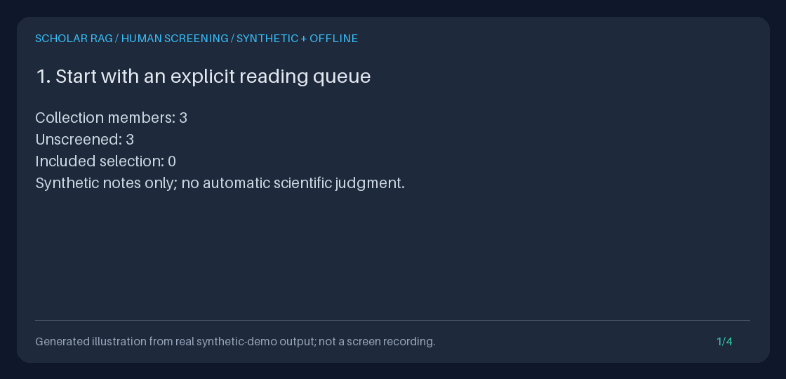

# Human paper screening

Save `include`, `exclude`, or `unsure` decisions on members of a named paper
collection, resume after restart, and explicitly pass the included IDs to
retrieval. Nothing labels a paper automatically or changes `/query` defaults.



This four-frame illustration is rendered from the executable demo's actual API
results. It is not a recording of a screening UI, a real literature review, or a
model's scientific conclusions.

## Why this workflow

[ASReview LAB](https://github.com/ASReview/asreview) documents persistent,
revisable human relevance labels and result export.
[PaperQA](https://github.com/Future-House/paper-qa) separates paper search,
evidence gathering, and answer generation. These projects informed this gap:
our existing collections saved membership, but did not save human screening
decisions before retrieval.

This implementation is original, model-free metadata management. It does not
implement ASReview's active learning or claim PaperQA's research performance.
The opt-in `PrismaScreeningChecklist` still produces advisory, always-pending
rows; it is not connected to these decisions. Saved-answer reviews judge an
answer after generation and remain a separate feature.

## Run the complete offline example

From the repository root with Python 3.11+:

```bash
uv sync --extra dev
OUTPUT="$(mktemp -d)"
uv run python scripts/demo_paper_screening.py \
  --output "$OUTPUT" --gif "$OUTPUT/paper-screening.gif"
```

The demo creates three synthetic notes and one collection, saves three human
opinions, restarts the application, previews only the included document, edits
the collection, and explicitly re-screens one stale decision. It writes
`screening.json`, `transcript.txt`, and the GIF to the printed shell variable's
directory. Existing artifact files are never overwritten; the temporary SQLite
database is removed on exit. Ambient provider keys, dotenv values, model
settings, and database paths are ignored. External HTTP and fake/live answer
generation are explicitly forbidden.

Expected observations: three initially unscreened members; one include, one
exclude and one unsure after review; the same queue after restart; one document
in the explicit retrieval preview; zero agent events; three stale decisions
after the collection revision changes; HTTP 409 for a stale write.

## API walkthrough

Start the isolated loopback API using the [Quickstart](../../QUICKSTART.md).
Ingest notes, then create a collection through
[the collection API](PAPER_COLLECTIONS_GUIDE.md). Its response supplies
`collection_id`, `revision`, and ordered `document_ids`.

```bash
COLLECTION_ID='replace-with-your-collection-id'
DOCUMENT_ID='replace-with-a-member-document-id'

curl --fail-with-body --silent --show-error \
  "http://127.0.0.1:8000/collections/$COLLECTION_ID/screening?collection_revision=1&limit=20"

curl --fail-with-body --silent --show-error -X PUT \
  "http://127.0.0.1:8000/collections/$COLLECTION_ID/screening/$DOCUMENT_ID" \
  -H 'Content-Type: application/json' \
  -d '{
    "collection_revision":1,
    "expected_decision_revision":0,
    "decision":"include",
    "reason":"Human judgment: relevant methods for my stated review question."
  }'
```

Use the actual collection revision, not always `1`. The first review uses
`expected_decision_revision: 0`. A successful write returns its new `revision`;
send that revision when changing the decision. There is no unconditional
overwrite. A repeated write with the old revision returns 409, so read back the
queue after an uncertain network outcome rather than retrying blindly.

Percent-encode document IDs when building URLs. Embedded slashes in existing
identities, such as `doi:10.1234/paper`, are preserved rather than treated as extra
routes. The API-generated `doc-...` IDs used above need no additional escaping.
Imported IDs retain the stored-document identity contract, including embedded
NUL characters. Human reason-text restrictions do not redefine document identity.

`GET` returns the collection ID/revision, `total_documents`, disjoint counts for
`unscreened`, `include`, `exclude`, `unsure`, and `stale`, a page of `items`, an
exclusive `next_cursor`, and `included_document_ids`. Each item has its exact
document ID, current status, and latest review or `null`. The review contains
the human reason, collection revision, decision revision, and server UTC update
time. It is the latest opinion, **not an append-only history**.

Queue order is saved collection-member order, not relevance ranking. Use
`status=unscreened` or another status to filter items and send `next_cursor` as
`cursor` for the next page. Counts and included IDs always cover the entire
current collection, not just that page or status filter. An unknown cursor is
an error. Labels may change between pages; pagination is not a multi-request
snapshot. All GET requests require the expected `collection_revision`.

Look up titles and bounded passages using the
[document catalog](DOCUMENT_CATALOG_GUIDE.md) and
[stored-chunk reader](DOCUMENT_CHUNKS_GUIDE.md); the queue does not copy paper
bodies or pretend IDs are bibliographic metadata.

### Explicit selection handoff

Take `included_document_ids` from a freshly read queue and send that list as
`document_ids` to `/retrieve`, `/query`, or a research worksheet. **Do not pass
`collection_id` instead:** the original collection still contains excluded,
unsure, stale and unscreened members, and ordinary collection scope is unchanged.

```json
{"query":"Which methods are described?","document_ids":["replace-with-an-included-document-id"]}
```

An empty included list is valid screening output, but cannot be queried: existing
scope validation rejects `document_ids: []` with 422. Do not omit that field or
replace the empty list with `null`; either would change the meaning of the
selection. No request is run automatically by screening.

## Python usage

For an existing corpus and collection:

```python
from pathlib import Path
from storage.paper_screening import ScreeningSubmission, SQLitePaperScreening

store = SQLitePaperScreening(Path("corpus.sqlite3"))
collection = store.collections.get("replace-with-your-collection-id")
page = store.list_queue(collection.collection_id, collection_revision=collection.revision)
member = page.items[0]
saved = store.submit(
    collection.collection_id,
    member.document_id,
    ScreeningSubmission(
        collection_revision=collection.revision,
        expected_decision_revision=member.review.revision if member.review else 0,
        decision="include",
        reason="Human judgment against the stated review criteria.",
    ),
)
current = store.list_queue(collection.collection_id, collection_revision=collection.revision)
if not current.included_document_ids:
    raise ValueError("No current included papers; screening is not ready for a query.")
# In async application code:
# preview = await container.runner.preview("Which methods?", document_ids=current.included_document_ids)
```

Initialization adds the decision table and reuses the collection store, but does
not ingest papers. Direct Python calls enforce the same strict revision, reason,
selection and page bounds. Python model copies are revalidated at submission.

## Staleness and concurrency

Any collection revision change, including a name-only edit used to signal revised
review criteria, makes all older decisions `stale`. The old opinion remains
visible, but cannot contribute to included IDs. Re-screen with the new collection
revision and the old decision's latest revision. Removed members are absent from
the queue; re-added members' older decisions remain stale.

Collection membership/existence checks, revision comparison, and decision writes
share one reserved SQLite transaction. Concurrent writes using the same expected
decision revision cannot both succeed. A queue and its included selection share
one read transaction. These checks do not lock a later retrieval request.

**Collection revisions do not detect edits to paper contents.** Replacing corpus
text under the same document ID does not automatically stale a decision. Review
source changes yourself and revise the collection/re-screen as appropriate.
Passing included IDs freezes a selection, not text or future human opinion.

## Bounds, errors, and privacy

| Contract | Limit or behavior |
| --- | --- |
| Collection membership | Existing bound of 1-100 document IDs |
| Page size | 1-100, default 20 |
| Reason | Nonblank UTF-8 text, 1-1000 characters; NUL and lone surrogates rejected |
| Revisions | Strict integers; collection/record 1 through SQLite's signed 64-bit maximum, expected decision may also be 0 |
| Stored record read | At most 16,385 characters per selected member; oversized or malformed records fail |
| Queue response | At most 524,288 UTF-8 bytes; request a smaller page on 413 |
| Storage | Latest decision per collection/document; no history, model call, or agent-event write |

HTTP 404 means unknown/deleted collection; 409 means a revision conflict,
missing corpus member, invalid saved data, or exhausted decision revision.
HTTP 422 means invalid inputs, a nonmember document, or invalid cursor; 413 means
the complete response cannot fit its byte budget; 503 means storage is
unavailable. Validation errors are sanitized rather than reflecting private
reasons or malformed Unicode. Successes and operational/validation errors use
`Cache-Control: no-store` and `X-Content-Type-Options: nosniff`.

Labels, reasons and IDs may be sensitive. This API has no authentication,
identity attribution, tenant isolation, or scientific verification. Keep it on
loopback and review permissions before sharing artifacts. Collection deletion
makes its queue inaccessible but does **not** erase stored decisions or source
data; there is no privacy-erasure or history-retention facility here.

For a portfolio demonstration, reproduce the offline artifacts, explain why
excluded/unsure/stale members never enter the exported selection, show the
conflicting-write response, and disclose that these are synthetic human opinions.
Do not present the GIF as a completed systematic review or a clinical conclusion.

## Model and stack context

The feature itself uses FastAPI, Pydantic and SQLite, not a model or active-learning
library. The existing agent remains a hand-written state machine with HTTPX
adapters. Official catalogs checked on **2026-10-01 America/Los_Angeles** list
[GPT-6 Astra](https://developers.openai.com/api/docs/models.md),
[Claude Sonnet 5.5 / Opus 5.5 / Fable 5.1](https://platform.claude.com/docs/en/models/overview),
[Gemini 3.8 Flash GA](https://ai.google.dev/gemini-api/docs/latest-model), and
[Kimi K3](https://platform.kimi.ai/docs/models). See the
[provider guide](PROVIDER_MODELS_GUIDE.md) for selected defaults and payload
limits. Catalog documentation and offline tests do not establish account access,
live compatibility, or scientific answer quality.
