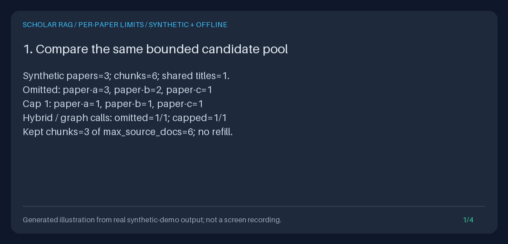

# Per-paper evidence limits

Pass `max_chunks_per_document` to **`POST /query` or `POST /retrieve`** to limit
how many final-context passages each actual `document_id` contributes. This is
an opt-in integration of `DiversityCapGate` into the real executor, not another
standalone ranking helper. Omission leaves the existing retrieval behavior intact.



**GIF provenance:** a generated illustration of the
[actual measured transcript](../assets/per-paper-evidence-limits.txt), not a screen
recording or live-model result. Three synthetic papers share the same title and
source label. Their six candidate chunks contribute **3/2/1 passages without a
quota, and 1/1/1 with cap 1**. These are plumbing measurements, not a recall or
scientific-quality benchmark.

## Reproduce the demonstration

From the repository root, with Python 3.11+ and uv:

```bash
uv sync --extra dev
DEMO_DIR="$(mktemp -d)"
uv run python -m scripts.demo_per_paper_evidence_limits --output-dir "$DEMO_DIR/artifacts"
uv run python -m scripts.create_per_paper_evidence_limits_gif \
  --transcript "$DEMO_DIR/artifacts/transcript.txt" \
  --output "$DEMO_DIR/per-paper-evidence-limits.gif"
uv run python -m json.tool "$DEMO_DIR/artifacts/comparison.json"
printf 'Review the synthetic artifacts in %s\n' "$DEMO_DIR"
```

The demo exercises real API routes, SQLite, hybrid/graph retrieval, reranking,
context capture, saved exports, and comparison. Its explicit chunk fixtures make
counts independent of ingestion chunk-boundary changes. It creates a temporary
database, reopens it to check saved artifacts, then removes that temporary
database. No caller corpus is opened, migrated, or backfilled.

The shared `scripts.demo_evidence_export.offline_settings()` ignores ambient
environment, `.env`, and secret-file settings and clears provider keys. Merely
setting a default provider to `fake` is **not** equivalent. The demo also denies
external HTTP. Previews make zero live/fake generation calls and zero agent-event
writes; three deliberate `/query` requests use only the fake adapter.

| Output | Contents |
| --- | --- |
| `baseline.json`, `limited.json` | Full generation-free responses for the same unscoped query |
| `collection.json`, `unknown.json` | Capped saved-selection and unknown-ID previews |
| `bundle.json`, `bundle.md` | Exact evidence export from the capped query |
| `comparison.json` | Cap 1 versus cap 2 on one paper with identical evidence |
| `transcript.txt` | Four measured panels used by the existing evidence GIF renderer |

Scripts refuse to overwrite their named outputs. Use a fresh directory/filename.
Run IDs and timestamps vary between runs; the transcript and GIF are deterministic
for these fixtures and the locked dependencies. The animation is not a fabricated
research UI.

## Request and scope contract

| Input | Meaning |
| --- | --- |
| Field omitted | No per-document quota; old unconfigured calls keep their signatures |
| Integer `1` through `50` | At most this many final-context chunks per `document_id` |
| HTTP `null`, booleans, strings, floats (including `1.0`), zero, negatives, values above 50 | HTTP 422 before runner work |
| Python `None` or omitted keyword | No quota; other invalid Python values raise `ValueError` before events |

The order of operations is **scope selection -> normal bounded retrieval/merge
-> normal reranking -> document quota -> exact evidence capture**. Selection is
the existing `DiversityCapGate.gate`; it retains the earliest eligible chunks in
reranked order without changing scores, text, or document ownership.

`SCHOLAR_RAG_MAX_SOURCE_DOCS` still bounds the candidate **chunk** pool before
reranking, not the number of distinct papers. A quota does not enlarge that
pool, oversample, retry retrieval, fetch more papers, or call another provider.
Consequently, fewer than `max_source_docs` passages can remain. Setting cap 50
does not increase any source, hop, timeout, context-byte, or capture limit.

`document_ids` constrains every normal retrieval branch before the quota.
Alternatively, pass `collection_id`; the API resolves its current membership
once before awaits. Do not pass both. Unknown document IDs can yield no passages;
unknown or broken collections fail explicitly. No cap, scope, or component
failure falls back to the whole corpus. Neither operation mutates shared index
configuration.

Counting is by actual document ID, **not title, source URL, or source label**.
Different IDs with identical titles each get a quota. Conversely, two versions
or duplicate ingestions with different IDs are not recognized as the same paper.
This is not deduplication or evidence-independence detection.

## Runnable offline API example

This executes the real HTTP routes in process with FastAPI's `TestClient`;
there is no network listener. The fixture and database are synthetic and temporary.
On your trusted API, send the same JSON body to the same paths.

```bash
uv run python - <<'PY'
from pathlib import Path
from tempfile import TemporaryDirectory
from fastapi.testclient import TestClient
from api.application import create_app
from scripts.demo_evidence_export import offline_settings
from scripts.demo_per_paper_evidence_limits import seed_corpus

with TemporaryDirectory() as directory:
    app = create_app(offline_settings(Path(directory) / "api.sqlite3"))
    seed_corpus(app.state.container)
    body = {
        "query": "retrieval evidence",
        "document_ids": ["paper-a", "paper-b"],
        "max_chunks_per_document": 1,
    }
    with TestClient(app) as client:
        response = client.post("/retrieve", json=body)
        response.raise_for_status()
        preview = response.json()
        assert app.state.container.event_log.list_events() == []
        response = client.post("/query", json=body)
        response.raise_for_status()
        run = response.json()["result"]
        assert run["state"] == "DONE", run["error"]
        path = f"/runs/{run['run_id']}/export"
        exported = client.get(path)
        exported.raise_for_status()
        bundle = exported.json()
        assert preview["sources"] == bundle["snapshot"]["sources"]
        assert preview["context_sha256"] == bundle["snapshot"]["context_sha256"]
        markdown = client.get(path, params={"format": "markdown"})
        markdown.raise_for_status()
        assert "max_chunks_per_document=1" in markdown.text
        print("API sources:", len(preview["sources"]))  # 2, one per selected paper
        print("Saved policy:", bundle["plan"]["observation"]["evidence_policy"])
PY
```

To use a saved selection, first `POST /collections` with
`{"name":"Synthetic selection","document_ids":["paper-a","paper-b"]}`, then
replace `document_ids` in the body with the returned `collection_id`.
Collection names and memberships are not copied into the policy; the resolved
IDs remain in `plan.observation.document_ids`.

## Runnable offline Python example

The same keyword is available on both runner entrypoints. There is no global
environment variable or shared mutable reranker setting for this feature.

```bash
uv run python - <<'PY'
import asyncio
from collections import Counter
from pathlib import Path
from tempfile import TemporaryDirectory
from api.dependencies import AppContainer
from scripts.demo_evidence_export import offline_settings
from scripts.demo_per_paper_evidence_limits import seed_corpus

async def main():
    with TemporaryDirectory() as directory:
        container = AppContainer(offline_settings(Path(directory) / "python.sqlite3"))
        seed_corpus(container)
        options = {"document_ids": ["paper-a", "paper-b"], "max_chunks_per_document": 1}
        preview = await container.runner.preview("retrieval evidence", **options)
        assert container.event_log.list_events() == []
        result = await container.runner.run("retrieval evidence", **options)
        assert result.state == "DONE", result.error
        bundle = container.evidence_exporter.export(result.run_id)
        assert preview.context == bundle.snapshot.request.context
        assert preview.context_sha256 == bundle.snapshot.context_sha256
        counts = Counter(source.chunk.document_id for source in preview.sources)
        assert counts == {"paper-a": 1, "paper-b": 1}
        print("Python sources:", len(preview.sources))
        print("Saved policy:", result.plan.observation.evidence_policy.model_dump())

asyncio.run(main())
PY
```

Use `container.paper_collections.resolve(collection_id)` to obtain immutable IDs
for Python calls; collection lookup remains separate from the runner.

## Inspect policy and provenance

The strict, frozen `EvidencePolicy` is copied into
`QueryObservation.evidence_policy` before asynchronous work. The same
`{"max_chunks_per_document": 1}` appears in the query observation, recorded plan,
initial planning event, preview plan, JSON evidence export, and the Markdown
**Per-paper evidence policy** section. The four-field version-one
`RunConfiguration` remains unchanged. Older saved runs without a policy read as
`None`; no quota is inferred retroactively and no migration/backfill runs.

Each kept source uses `retriever="diversity_cap_gate"`; its `path` appends the
actual previous reranker label. Scores, full chunks, and text digests are retained;
ranks are reassigned consecutively in the filtered context. Context and its digest
reflect exactly the passages passed to generation. Preview and query match for an
unchanged corpus and deterministic retrieval/reranking; a preview does **not**
freeze future corpus changes or promise deterministic output from a live model.

Saved-run comparisons copy each run's policy into `baseline.evidence_policy` and
`candidate.evidence_policy`. `changes.evidence_policy_changed` contributes to
`any_changes`, even when context is identical or both contexts are empty. A notice
warns about differing policies. This is input/provenance inspection, not proof
that a quota improves an answer or a controlled model A/B test.

Custom executors keep old signatures for unconfigured calls. To opt in, their
`prepare_context`/`answer` overrides must accept the frozen `evidence_policy`
keyword, preserve it in the plan, and honor the shared preparation/capture
contract. Query answers must support the evidence callbacks and record the capped
snapshot. Unsupported signatures, missing capture, quota violations, missing gate
provenance, or dropped policy fail explicitly; the runner never retries uncapped.

Custom implementations are **trusted code, not sandboxed extensions**. The
built-in executor validates prepared evidence before generation. An arbitrary
keyword-accepting `answer` override that skips capture is detected only after
it returns; this cannot undo that override's own provider calls or side effects.

| Failure | Result |
| --- | --- |
| Invalid HTTP input | 422; no run or retrieval starts |
| Unknown / broken collection | 404 / 409; collection storage failures remain 503 |
| Query operational failure, including unsupported executor policy | Existing HTTP 200 with `result.state="ERROR"`; inspect `result.error` |
| Preview preparation/unsupported-component failure | Sanitized 500, no partial evidence or event writes |
| Preview LLM-backed HyDE / phase timeout | 409 / 504; no substitute retrieval algorithm |
| Inconsistent saved policy, quota, or gate provenance | Export 409 `invalid_run_record`, not repaired or reconstructed evidence |

## Limitations, privacy, and portfolio use

A quota can discard useful context. It guarantees neither distinct-paper
coverage nor study quality, recall, completeness, correctness, source independence,
or semantic diversity. Grounding remains a token-overlap check, not entailment.
Review opposing findings and original documents; this is not a systematic review
or a medical decision system.

Live `/query` generation still sends the query and retained context to its
configured provider, even when the context is empty. Previews and exports contain
full source text, identifiers, paths, and metadata. They are not redacted;
no-store headers, document selection, quotas, and digests are not authentication,
tenant isolation, or signatures. Saved evidence outlives corpus changes.

For a portfolio demonstration, show the measured baseline/cap counts, unchanged
retrieval-call counts, shared context digest, and policy-only comparison change.
Share only reviewed synthetic artifacts and label the fake answer honestly.
Use the [provider guide](PROVIDER_MODELS_GUIDE.md) for current model setup; this
provider-independent feature makes no new model compatibility claim.

**Design references, checked 2026-09-26 (America/Los_Angeles):**
[PaperQA](https://github.com/Future-House/paper-qa) motivates selectable/scored
scientific evidence and grounded source inspection; its LLM-based RCS workflow
is not implemented here.
[LangChain's Chroma integration](https://docs.langchain.com/oss/python/integrations/vectorstores/chroma)
documents retriever search controls and embedding-based MMR. This deterministic
document quota is **neither LLM RCS nor embedding MMR**, and claims no parity or
benchmark improvement. No upstream implementation or documentation was copied.

See the [README workflows](../../README.md#choose-a-workflow),
[documentation catalog](../README.md), [Architecture](../../ARCHITECTURE.md),
[Safety](../../SAFETY.md), [Configuration](../../CONFIGURATION.md),
[document scope](DOCUMENT_SCOPE_GUIDE.md), and
[saved-run comparison](RUN_COMPARISON_GUIDE.md).
