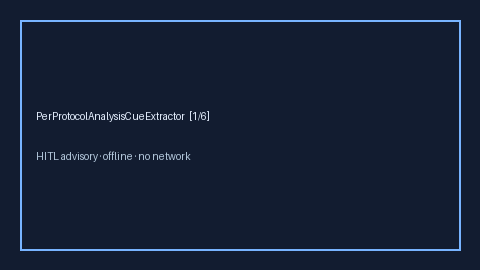

# PerProtocolAnalysisCueExtractor Guide



Offline advisory cue extractor. Never calls the network.
Closes Elicit / Consensus / CONSORT per-protocol analysis gaps.

Optional polish via **GPT-5.5 / Claude Sonnet 4.6 / Gemini 3.x / Kimi K2**.

Distinct from IntentionToTreatCueExtractor / ProtocolDeviationCueExtractor.

## Usage

```python
from retrieval.per_protocol_analysis_cues import PerProtocolAnalysisCueExtractor

rows = PerProtocolAnalysisCueExtractor().extract(
    [{"paper_id": "p1", "methods": "Primary analysis used a per-protocol population."}]
)
print(rows[0].flagged, rows[0].cues)
```
