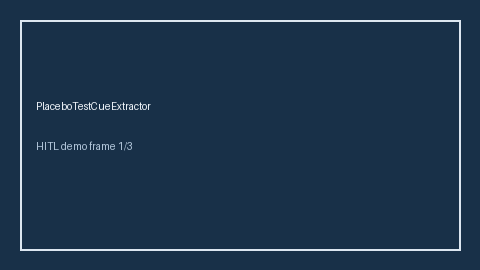

# PlaceboTestCueExtractor Guide



Offline cue extractor. Never network I/O. Gap vs Elicit/Consensus/AJE placebo-test / falsification cue extractors.

Optional later polish via **GPT-5.5 / Claude Sonnet 4.6 / Gemini 3.x / Kimi K2**.

Distinct from `NegativeControlOutcomeCueExtractor / SyntheticControlCueExtractor`.

## Usage

```python
from retrieval.placebo_test_cues import PlaceboTestCueExtractor

cues = PlaceboTestCueExtractor().extract(
    [
        {
            "paper_id": "p1",
            "abstract": "We ran a placebo test and falsification check with null effect.",
        }
    ]
)
assert cues[0].flagged is True
```

## Safety

Advisory cues only. No HTTP. Humans decide. See `SAFETY.md`.
