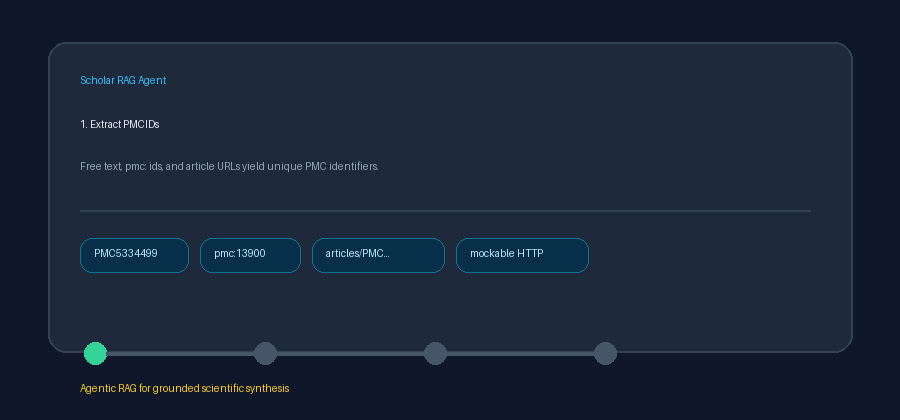

# PMC OA Package Guide



Use this guide when wiring NCBI PMC Open Access package link discovery into
**scholar-rag-agent**. The agent can route enrichment through GPT-5.5 /
Claude Sonnet 4.6 / Gemini 3.x / Kimi K2 when enabled, but the PMC OA package
connector itself is deterministic HTTP plus XML parsing; no LLM is required to
resolve package or PDF download URLs.

## Why PMC OA packages

`PmcConnector` searches PubMed Central and fetches article XML via E-utilities.
Many downstream jobs also need the **bulk OA package** (or PDF) that NCBI hosts
on its FTP mirror. The OA web service answers that question for a known PMCID:

```text
GET https://www.ncbi.nlm.nih.gov/pmc/utils/oa/oa.fcgi?id=PMC5334499
```

The response lists downloadable `tgz` article packages and, when available,
`pdf` files. This connector extracts PMCIDs from free text, looks each one up,
and normalizes the links into `Document` metadata so retrieval and download
hooks can consume them without scraping article HTML.

## What you get

| Field | Source |
|---|---|
| `title` | OA `record@citation`, else a PMCID fallback title |
| `text` | PMCID descriptor plus citation, license, package URL, and PDF URL |
| `source` | HTTPS PDF URL when present, else HTTPS package (`.tar.gz`) URL, else PMC article landing page |
| `metadata.pmcid` | OA `record@id` normalized with a `PMC` prefix |
| `metadata.citation` | OA `record@citation` |
| `metadata.license` | OA `record@license` |
| `metadata.retracted` | OA `record@retracted` |
| `metadata.year` | Best-effort four-digit year parsed from the citation |
| `metadata.package_url` | `link[@format='tgz']/@href` rewritten to HTTPS when hosted on NCBI FTP |
| `metadata.pdf_url` | `link[@format='pdf']/@href` rewritten to HTTPS when hosted on NCBI FTP |
| `metadata.formats` | Comma-joined sorted link formats (for example `pdf,tgz`) |
| `metadata.source_type` | `"pmc_oa"` |

## Example

```python
import asyncio

from ingestion.pmc_oa import PmcOaPackageConnector

documents = asyncio.run(
    PmcOaPackageConnector(email="dev@example.org").search(
        "Download packages for PMC5334499 and pmc:13900",
        max_results=5,
    )
)
for document in documents:
    print(
        document.metadata["pmcid"],
        document.metadata["package_url"],
        document.metadata["pdf_url"],
    )
```

## Safety notes

- Blank queries, non-positive `max_results`, and queries without PMCID-shaped
  tokens short-circuit with no HTTP call.
- Lookups are capped at **20** PMCIDs per call.
- Missing identifiers (`idDoesNotExist`) and HTTP failures are skipped so one
  miss does not fail a batch.
- Tests mock `httpx.AsyncClient` and never make live NCBI OA calls.
- Pass a contact email only for live usage; the connector forwards it as
  `email=` when provided.
