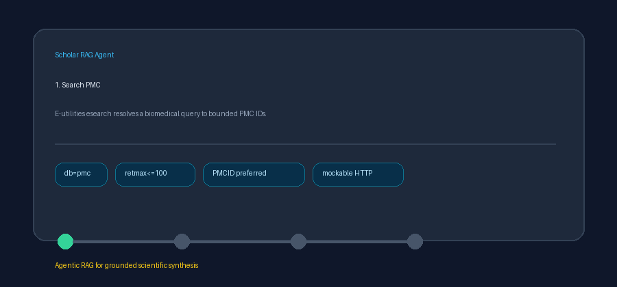

# PMC Source Guide



Use this guide when wiring PubMed Central (PMC) into **scholar-rag-agent**. The
agent can route enrichment through GPT-5.5 / Claude Sonnet 4.6 / Gemini 3.x /
Kimi K2 when enabled, but the PMC connector itself is deterministic E-utilities
HTTP plus XML parsing; no LLM is required to list or normalize full-text records.

## Why PMC

PMC is NCBI's full-text archive for biomedical and life-sciences literature. It
complements PubMed citation/abstract search and Europe PMC federation with
canonical PMCID landing pages and open article XML that often includes abstracts,
article bodies, authors, DOI, PMID, and publication dates.

The connector uses a two-step, mockable E-utilities flow:

```
GET https://eutils.ncbi.nlm.nih.gov/entrez/eutils/esearch.fcgi?db=pmc&term=clinical+rag&retmax=5&retmode=json
GET https://eutils.ncbi.nlm.nih.gov/entrez/eutils/efetch.fcgi?db=pmc&id=7654321&retmode=xml
```

`retmax` is capped at **100** in this connector. Tests mock `httpx.AsyncClient`
responses and never make live NCBI calls.

## What you get

| Field | Source |
|---|---|
| `title` | `article-meta/title-group/article-title` |
| `text` | Abstract plus a bounded full-text body excerpt when available, else body excerpt only |
| `source` | `https://pmc.ncbi.nlm.nih.gov/articles/{PMCID}/`, else DOI URL, else title |
| `metadata.pmcid` | `article-id pub-id-type="pmc"` normalized with a `PMC` prefix |
| `metadata.pmid` | `article-id pub-id-type="pmid"` |
| `metadata.doi` | `article-id pub-id-type="doi"` |
| `metadata.year` | First publication year in article metadata |
| `metadata.authors` | Comma-joined author contributor names |
| `metadata.source_type` | `"pmc"` |

## Example

```python
import asyncio

from ingestion.pmc import PmcConnector

documents = asyncio.run(PmcConnector(email="dev@example.org").search("clinical rag", max_results=5))
for document in documents:
    print(document.metadata["pmcid"], document.title)
```

## Safety notes

- Blank queries and non-positive `max_results` short-circuit with no HTTP call.
- Search and fetch requests are bounded by the connector result cap.
- Articles without a title are skipped rather than raising.
- Pass an NCBI API key or contact email only for live usage; tests should keep
  the E-utilities calls mocked.
