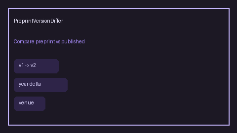

# Preprint Version Differ Guide



`PreprintVersionDiffer` compares preprint vs published metadata offline using
version labels (`v1`/`v2`), year delta, and venue presence. It returns a
`PreprintVersionDiff` with `status`, human-readable `reasons`, and a `prefer`
side.

Status values include `same_work_preprint_older`, `published_preferred`,
`preprint_only`, and `unknown`.

Fills a Semantic Scholar / ResearchRabbit version-diff gap with deterministic
heuristics (no LLM or network call). Diffs can seed GPT-5.5 / Claude Sonnet 4.6 /
Gemini 3.x / Kimi K2 synthesis. Distinct from `PreprintDemoter` (retrieval soft
demotion of preprint hits); this module compares caller-supplied metadata pairs.

## Usage

```python
from retrieval.preprint_version import PreprintVersionDiffer

differ = PreprintVersionDiffer()
report = differ.diff(
    {"title": "Graph RAG", "year": 2023, "version": "v1", "venue": "arXiv"},
    {"title": "Graph RAG", "year": 2024, "version": "v2", "venue": "ACL"},
)
print(report.status, report.prefer, report.reasons)
```

Missing published metadata yields `preprint_only`. Missing both sides yields
`unknown`. Preprint-server venue strings (arXiv/bioRxiv/medRxiv/SSRN) are not
treated as published venues for preference.
