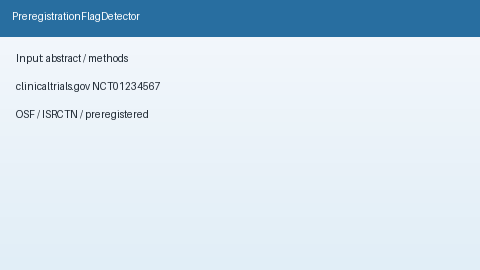

# Preregistration Flag Detector Guide



`PreregistrationFlagDetector` scans abstract / methods / registration text for
offline preregistration cues (`clinicaltrials.gov`, `NCT########`, OSF /
`osf.io`, `ISRCTN…`, `preregistration` / `pre-registration` /
`preregistered`). It returns advisory flags with reasons and matched cues. It
never calls the network.

Distinct from `FundingDisclosureFlagger` (funder/grant cues) and
`PrismaScreeningChecklist` (HITL PRISMA screening rows). Fills an Elicit /
Consensus / SciSpace / PaperQA preregistration-cue surfacing gap with
deterministic heuristics. Optional later narrative can use GPT-5.5 /
Claude Sonnet 4.6 / Gemini 3.x / Kimi K2.

## Usage

```python
from retrieval.preregistration_flag import PreregistrationFlagDetector

flags = PreregistrationFlagDetector().detect(
    [
        {
            "paper_id": "p1",
            "abstract": "Registered at clinicaltrials.gov (NCT01234567).",
        },
        {
            "paper_id": "clear",
            "abstract": "We study transformers without registry identifiers.",
        },
    ]
)
for flag in flags:
    print(flag.paper_id, flag.flagged, flag.reasons, flag.matched_cues)
```

Empty paper lists return an empty tuple. Inputs are not mutated.
