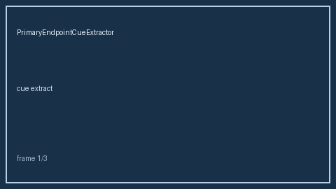

# PrimaryEndpointCueExtractor Guide



`PrimaryEndpointCueExtractor` Extract offline primary/co-primary/secondary endpoint cues; fills an Elicit/Consensus/ClinicalTrials.gov/PaperQA primary-endpoint gap (distinct from EffectSizeHintExtractor)

Never calls the network. Optional later narrative: **GPT-5.5 / Claude Sonnet 4.6 / Gemini 3.x / Kimi K2**.

## Usage

```python
from retrieval.primary_endpoint_cues import PrimaryEndpointCueExtractor

rows = PrimaryEndpointCueExtractor().extract([{"paper_id": "p1", "abstract": "..."}])
print(rows[0].flagged, rows[0].cues)
```
