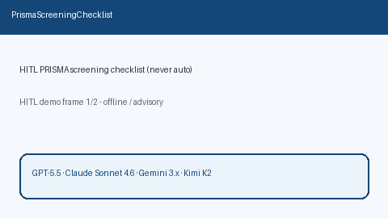

# PRISMA Screening Checklist Guide



`PrismaScreeningChecklist` builds HITL PRISMA-style title/abstract screening
rows from caller-supplied inclusion/exclusion criteria and paper metadata.
Lexical criterion hits are advisory cues only. Every row keeps
`decision="pending"` — this module never auto-includes or auto-excludes papers.

Fills a Covidence / Elicit / Rayyan PRISMA screening-checklist gap with
deterministic scaffolding. Optional later narrative can use GPT-5.5 /
Claude Sonnet 4.6 / Gemini 3.x / Kimi K2.

## Usage

```python
from retrieval.prisma_screening import PrismaScreeningChecklist

rows = PrismaScreeningChecklist().build(
    [
        {
            "paper_id": "p1",
            "title": "RCT of drug X in adults",
            "abstract": "Randomized trial.",
        },
        {
            "paper_id": "p2",
            "title": "Case report of drug X",
            "abstract": "Single patient.",
        },
    ],
    inclusion=["randomized trial", "adults"],
    exclusion=["case report", "animal"],
)
for row in rows:
    print(row.paper_id, row.decision, row.inclusion_hits, row.exclusion_hits)
    print(row.checklist)
```

Empty paper lists return an empty tuple. Inputs are not mutated.
