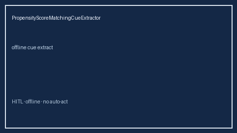

# PropensityScoreMatchingCueExtractor Guide



Closes Elicit / Consensus / AJE propensity-score matching gaps.

Optional later polish via **GPT-5.5 / Claude Sonnet 4.6 / Gemini 3.x / Kimi K2**.

Distinct from `ConfoundingAdjustmentCueExtractor` and `NegativeControlOutcomeCueExtractor`.

## Usage

```python
from retrieval.propensity_score_matching_cues import PropensityScoreMatchingCueExtractor

rows = PropensityScoreMatchingCueExtractor().extract(
    [
        {
            "paper_id": "p1",
            "methods": "We applied propensity score matching with a caliper and checked standardized mean difference balance.",
        }
    ]
)
print(rows[0].flagged, rows[0].cues)
```

## Safety

Offline patterns only. No HTTP. Humans interpret evidence cues.
