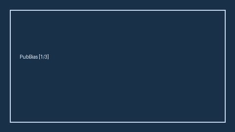

# Publication Bias Cue Extractor Guide



`PublicationBiasCueExtractor` scans title/abstract/methods/results/discussion
for offline publication-bias cues (funnel plot, Egger's test, small-study
effects, trim-and-fill). Never calls the network.

Distinct from `HeterogeneityI2HintExtractor`, `RiskOfBiasCueExtractor`, and
`EffectSizeHintExtractor`. Fills an Elicit / Consensus / SciSpace / PaperQA
publication-bias gap. Optional later narrative: **GPT-5.5 / Claude Sonnet 4.6 /
Gemini 3.x / Kimi K2**.

## Usage

```python
from retrieval.publication_bias_cues import PublicationBiasCueExtractor

rows = PublicationBiasCueExtractor().extract(
    [{"paper_id": "p1", "abstract": "Funnel plot asymmetry was observed."}]
)
print(rows[0].cues, rows[0].flagged)
```
