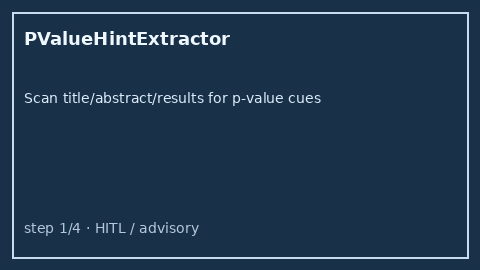

# P-Value Hint Extractor Guide



`PValueHintExtractor` scans title / abstract / results text for offline
p-value cues (`p < 0.05`, `p=0.01`, `P-value = 0.003`, `P value: 0.12`,
`p<=0.001`). It returns advisory operator + numeric value pairs with the
matched cue string. It never calls the network.

Distinct from `EffectSizeHintExtractor` (Cohen's d / OR / HR / RR / AUC) and
`SampleSizeHintExtractor` (N= sample-size integers). Fills an Elicit /
Consensus / SciSpace / PaperQA p-value surfacing gap with deterministic
heuristics. Optional later narrative can use GPT-5.5 / Claude Sonnet 4.6 /
Gemini 3.x / Kimi K2.

## Usage

```python
from retrieval.p_value_hint import PValueHintExtractor

hints = PValueHintExtractor().extract(
    [
        {
            "paper_id": "p1",
            "abstract": "The primary endpoint reached significance (p < 0.05).",
        },
        {
            "paper_id": "clear",
            "abstract": "We study transformers without reported significance tests.",
        },
    ]
)
for hint in hints:
    print(hint.paper_id, hint.operator, hint.value, hint.matched_cue)
```

When multiple cues match, the earliest match in concatenated text wins.
Empty paper lists return an empty tuple. Inputs are not mutated.
