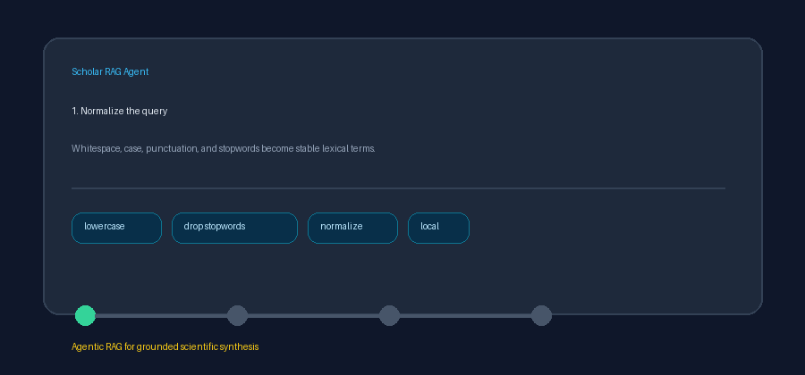

# Deterministic Query Rewrite Guide



Use `QueryRewriter` before retrieval when domain terminology differs across
papers. It normalizes a query and expands only a caller-provided synonym map,
so behavior remains local, inspectable, and reproducible. This is lexical query
expansion, not HyDE: it generates no hypothetical document and requires no LLM.
Optional downstream stages can use GPT-5.5 / Claude Sonnet 4.6 / Gemini 3.x /
Kimi K2 after retrieval.

## Rewrite behavior

The rewriter:

1. Lowercases terms and normalizes whitespace and surrounding punctuation.
2. Removes the shared retrieval stopwords, or a custom supplied collection.
3. Matches synonym keys case-insensitively, preferring the longest phrase.
4. Retains the original term or phrase and appends each configured synonym.
5. Deduplicates equivalent synonym phrases while preserving configured order.

## Example

```python
from retrieval.query_rewrite import QueryRewriter

rewriter = QueryRewriter(
    {
        "gnn": ["graph neural network", "graph convolutional network"],
        "tumour": "cancer",
    }
)

expanded = rewriter.rewrite("GNN methods for tumour prediction")
# "gnn graph neural network graph convolutional network methods
#  tumour cancer prediction"
```

The provided mapping is copied during construction, so later mutations do not
change rewrite behavior.

## Multi-query variants

`variants()` returns distinct queries that can be retrieved independently and
combined with reciprocal-rank fusion:

```python
queries = rewriter.variants(
    "GNN methods for tumour prediction",
    max_variants=5,
)
result_lists = [await retriever.retrieve(query) for query in queries]
fused = reciprocal_rank_fusion(result_lists)
```

The normalized base query comes first, followed by the all-synonyms expansion
and then single-synonym substitutions in query order. `max_variants` must be a
positive integer. Blank and stopword-only queries rewrite to `""` and produce
no variants.
