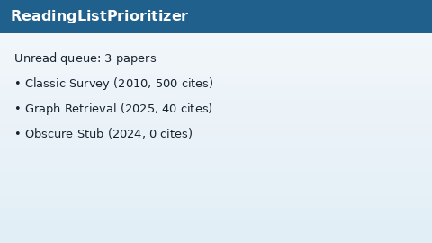

# Reading List Prioritizer Guide



`ReadingListPrioritizer` triages unread papers by a deterministic
**novelty × authority** score. Authority comes from log-normalized citation
counts; novelty blends publication-year freshness with batch-relative keyword
rarity. Results include human-readable `reasons`.

Fills a Zotero / ResearchRabbit unread-triage gap with offline heuristics
(no LLM or network call). Ranked lists can seed GPT-5.5 / Claude Sonnet 4.6 /
Gemini 3.x / Kimi K2 synthesis. Distinct from `FreshnessBooster`,
`NoveltyDiversifier`, and `AuthorityBooster` (retrieval boosters); this module
ranks a reading list, not `SearchResult` hits.

## Usage

```python
from retrieval.reading_list import ReadingListPrioritizer

prioritizer = ReadingListPrioritizer(
    freshness_weight=0.5,
    reference_year=2026,
    half_life_years=3.0,
)
ranked = prioritizer.prioritize(
    [
        {
            "title": "Novel Graph Retrieval for Multi-Hop Reasoning",
            "year": 2025,
            "citation_count": 40,
            "keywords": ["graph", "retrieval", "multi-hop"],
        },
        {
            "title": "Classic Survey of Optics",
            "year": 2010,
            "cited_by_count": 500,
            "keywords": ["optics", "lasers"],
        },
    ]
)
for row in ranked:
    print(row.title, row.priority_score, row.novelty, row.authority, row.reasons)
```

Empty paper lists return an empty tuple. Citation fields may be
`citation_count`, `cited_by_count`, or `citations`. Years may come from
`year`, `published_at`, or `date`. Keywords may be lists under `keywords` /
`topics`, or inferred from `abstract` / `title`.
