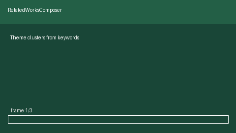

# Related Works Composer Guide



`RelatedWorksComposer` builds a structured **Related Works** section outline
from paper titles, abstracts, and years. Papers are greedily clustered into
themes by keyword Jaccard overlap — fully offline and deterministic.

Fills an Elicit / PaperQA related-work generation gap with reproducible
scaffolding (no LLM call). Optional later prose drafting can use GPT-5.5 /
Claude Sonnet 4.6 / Gemini 3.x / Kimi K2. Distinct from
`LiteratureReviewOutliner` (section-type routing of ranked hits) and from
retrieval gates.

## Usage

```python
from retrieval.related_works import RelatedWorksComposer

composer = RelatedWorksComposer(overlap_threshold=0.18, max_themes=6)
outline = composer.compose(
    [
        {
            "title": "Graph Retrieval Augmented Generation",
            "abstract": "We survey graph retrieval for RAG.",
            "year": 2024,
        },
        {
            "title": "Knowledge Graph Retrieval for QA",
            "abstract": "Graph retrieval improves QA over corpora.",
            "year": 2023,
        },
    ],
    title="Related Works",
)
print(outline.to_markdown())
```

Each theme section lists papers sorted by year descending, with a short
keyword-overlap summary suitable for drafting.
