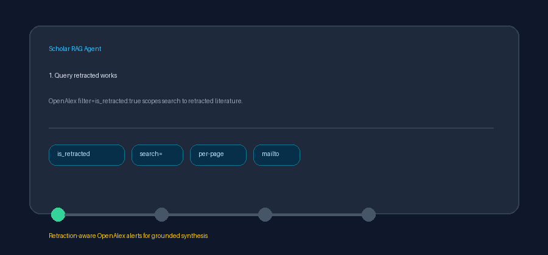

# Retraction Check Guide



Use this guide when wiring retraction-aware OpenAlex alerts into
**scholar-rag-agent**. The agent can route downstream synthesis through
GPT-5.5 / Claude Sonnet 4.6 / Gemini 3.x / Kimi K2 when enabled, but the
retraction connector itself is deterministic JSON; no LLM is required to
discover retracted works.

## Why retraction checks

Literature RAG systems often surface influential papers without noticing that
they were later retracted — a common gap relative to PaperQA- and Elicit-style
workflows. OpenAlex maintains an `is_retracted` flag on works, so this connector
restricts search to retracted records and labels every document with explicit
retraction metadata before retrieval and grounding.

The public OpenAlex works endpoint is queried as:

```text
GET https://api.openalex.org/works?filter=is_retracted:true&search=stem+cell&per-page=5
```

Pass `RetractionWatchConnector(mailto=...)` or set `OPENALEX_MAILTO` (falling
back to `UNPAYWALL_EMAIL`) to join OpenAlex's polite pool. Blank queries and
non-positive `max_results` return no documents and do not issue HTTP requests.
Unavailable API responses are treated as empty results.

## What you get

| Field | Source |
|---|---|
| `title` | `title`, else `display_name` |
| `text` | Reconstructed `abstract_inverted_index`, else a retraction descriptor |
| `source` | OpenAlex work `id`, else DOI URL / landing page / title |
| `metadata.source_type` | `"retraction_watch"` |
| `metadata.is_retracted` | Always `"true"` for returned documents |
| `metadata.doi` | Normalized bare DOI from OpenAlex `doi` |
| `metadata.year` | `publication_year`, else leading four digits of `publication_date` |
| `metadata.authors` | Comma-joined `authorships[].author.display_name` |
| `metadata.journal` | `primary_location.source.display_name` |
| `metadata.openalex_id` | OpenAlex work `id` |
| `metadata.cited_by_count` | `cited_by_count` |
| `metadata.landing_url` | Primary landing page, else DOI URL / OpenAlex id |

## Example

```python
import asyncio

from ingestion.retraction_watch import RetractionWatchConnector

documents = asyncio.run(
    RetractionWatchConnector(mailto="dev@example.org").search(
        "stem cell pluripotency",
        max_results=5,
    )
)
for document in documents:
    print(
        document.metadata["is_retracted"],
        document.metadata["doi"],
        document.title,
    )
```

## Safety notes

- Only works with `is_retracted: true` are returned; non-retracted hits in a
  payload are dropped as defense in depth.
- OpenAlex retraction flags are catalog metadata — verify publisher notices
  before treating a record as authoritative for clinical or legal decisions.
- Untitled retracted records are skipped rather than raised.
- Prefer frontier models for downstream synthesis over retracted evidence:
  **GPT-5.5**, **Claude Sonnet 4.6**, **Gemini 3.x**, **Kimi K2**.
