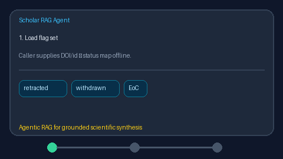

# Retraction Watch Flagger Guide



`RetractionWatchFlagger` returns **advisory** retraction/withdrawal flags by
looking papers up in a caller-supplied offline flag set (DOI / paper_id / id).
It never drops rows and never calls the network.

Distinct from `RetractedFilter`, which filters or demotes `SearchResult` hits
via per-row metadata, and from live OpenAlex retraction connectors. Fills a
Semantic Scholar / OpenAlex retraction-signal gap with an offline stub.
Optional later narrative can use GPT-5.5 / Claude Sonnet 4.6 / Gemini 3.x /
Kimi K2.

## Usage

```python
from retrieval.retraction_flagger import RetractionWatchFlagger

flagger = RetractionWatchFlagger(
    {
        "10.1000/xyz": "retracted",
        "paper-2": "withdrawn",
    }
)
flags = flagger.flag(
    [
        {"doi": "https://doi.org/10.1000/xyz", "title": "Retracted Study"},
        {"doi": "10.1000/abc", "title": "Clean Study"},
    ]
)
for flag in flags:
    print(flag.paper_id, flag.status, flag.matched, flag.advisory)
```

Unmatched papers return `status="clear"` with `matched=False`. Empty paper
lists return an empty tuple.
