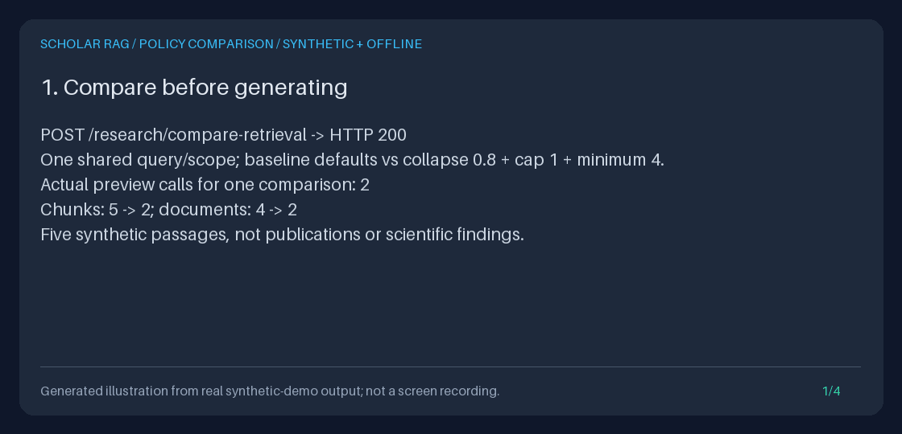

# Compare retrieval policies before generating

`POST /research/compare-retrieval` runs **two real, generation-free previews**
for one shared query and scope. Compare ordinary evidence selection with a
candidate near-duplicate threshold, per-document quota, or minimum-document
requirement before deciding whether to call `/query`. The Python entrypoint is
`AppContainer.retrieval_comparator.compare(RetrievalComparisonRequest(...))`.

This is **current-corpus inspection, not a controlled experiment, a frozen
corpus, scientific support, or a retrieval-quality metric**. There is no ground
truth. Two sequential awaits may observe concurrent corpus, index, or runtime
configuration changes. Even with identical identities, passages or provenance
can change. The output reports those differences rather than attributing them
solely to the policy.



This four-frame illustration is rendered from actual new-API output. It is not
a screen recording, a live-model screenshot, or a scientific evaluation.

## Why a separate comparison

The workflow references checked **2026-10-08 America/Los_Angeles** are
[Haystack's component/end-to-end evaluation guide](https://docs.haystack.deepset.ai/docs/evaluation),
[PaperQA's configurable evidence-gathering workflow and bundled settings](https://github.com/Future-House/paper-qa),
and [kotaemon's configurable retrieval/generation UI and citation previews](https://github.com/Cinnamon/kotaemon).
They motivate inspecting configuration choices and separating evidence gathering
from generation. Haystack also distinguishes statistical and model-based
evaluators; this feature is neither kind of evaluator. These are primary-source
workflow references, not dependencies, copied code, feature-parity claims, or
comparative quality measurements.

The existing [single preview](RETRIEVAL_PREVIEW_GUIDE.md) shows one policy.
[Saved-run comparison](RUN_COMPARISON_GUIDE.md) instead needs two **completed**
saved answers and never reretrieves. A [worksheet](RESEARCH_WORKSHEET_GUIDE.md)
inspects questions against individual papers. This comparison adds the missing
bounded, side-by-side **policy** inspection before any fake or live generation.
It reuses the real preview and pure exact source-comparison logic, not fabricated
evidence bundles, completed runs, new ranking algorithms, or another cue helper.

## Practical compare-before-query workflow

1. Start the isolated loopback API in the [Quickstart](../../QUICKSTART.md), ingest
   text you may process, and recover document IDs through `/documents` or `/explore`.
2. Select a small scope. Use explicit `document_ids` or one saved `collection_id`,
   never both. A screened reading list needs explicit included IDs: collection
   scope includes **all** members, not only papers labelled include.
3. Compare a baseline `{}` with one candidate policy. Inspect removed passages,
   exact shared-source changes, actual limits, and any unmet minimum; do not assume
   fewer bytes or a larger overlap means better evidence.
4. Save the comparison for human review. If generation is appropriate, explicitly
   copy the chosen scope and policy fields into a separate `/query` request.
   Generation reretrieves the then-current corpus; it does not consume the
   comparison as a frozen context. Inspect the query's state and saved evidence.

With the API running, this complete request uses the full current corpus:

```bash
curl --fail-with-body --silent --show-error \
  http://127.0.0.1:8000/research/compare-retrieval \
  -H 'Content-Type: application/json' \
  -d '{
    "query": "What retrieval methods are described?",
    "baseline": {},
    "candidate": {
      "evidence_policy": {
        "near_duplicate_threshold": 0.8,
        "max_chunks_per_document": 1,
        "min_evidence_documents": 2
      }
    }
  }' | uv run python -m json.tool
```

Add `"document_ids": ["FIRST_DOCUMENT_ID", "SECOND_DOCUMENT_ID"]` at the top
level with actual ingested IDs, or `"collection_id": "YOUR_SAVED_COLLECTION_ID"`
using an ID returned by `/collections`. Scope belongs to the shared request,
not to individual variants. Collection identity, revision, and membership are
read in **one transaction before the first preview**. Editing/deleting that
collection afterwards does not retarget the second preview.

Exactly `baseline` and `candidate` are required. Each is `{}` for ordinary
defaults, or an object containing `evidence_policy` with one or more of the
existing fields. Both may have policies or both may use defaults. Empty
`evidence_policy: {}`, explicit `null` policies/options/scopes, third variants,
per-variant scopes/queries, and provider/model overrides are rejected.

| Policy field | Accepted value and meaning |
| --- | --- |
| `near_duplicate_threshold` | Finite strict number greater than 0 and at most 1; lexical meaningful-term Jaccard collapse after reranking, not semantic equivalence |
| `max_chunks_per_document` | Strict integer 1-50; quota after any collapse, without candidate refill |
| `min_evidence_documents` | Strict integer 1-50; count distinct final-context document IDs, retaining all preview evidence when unmet |

Booleans and numeric strings are not policy numbers. Omitted fields keep
ordinary behavior. The comparison never mutates runner settings or changes
`/retrieve` or `/query` defaults.

For a Markdown download, add `?format=markdown` to the same URL and send the
same body. JSON is the default and the only other format. Successful attachments
are named `retrieval-comparison.json` or `retrieval-comparison.md`; both have
`Cache-Control: no-store` and `X-Content-Type-Options: nosniff`. Save only an
HTTP-success response: error bodies are diagnostics, not partial comparisons.
The interactive request and full response schema are available at `/docs`.

After inspection, the corresponding **separate** generation request uses flat
policy fields, as the existing query API requires:

```bash
curl --fail-with-body --silent --show-error http://127.0.0.1:8000/query \
  -H 'Content-Type: application/json' \
  -d '{
    "query": "What retrieval methods are described?",
    "near_duplicate_threshold": 0.8,
    "max_chunks_per_document": 1,
    "min_evidence_documents": 2
  }'
```

Include the same selected IDs if the comparison was scoped. `/query` may invoke
a configured provider or the offline fake. If the minimum is unmet, it records
`result.state: "ERROR"` without generation, even though the query HTTP status
is 200. Do not silently lower the requirement just to obtain an answer.

## Read the comparison

`schema_version: "1.0"` and `kind: "retrieval_policy_comparison"` identify this
inspection, not a run. The original bounded `query` is preserved; preview
observations retain the analyzer's normal outer-whitespace trimming.
`document_ids` is the resolved ordered selection, or `null` for unscoped.
`collection` is `null` or `{collection_id, revision}`; the revision identifies
membership, not document contents.

| Field | Exact meaning |
| --- | --- |
| `baseline`, `candidate` | Each has a **complete** `preview`: inspection plan, copied effective configuration, full ordered chunks/metadata/scores/paths, exact context/digest, capture limits, and minimum assessment when requested |
| Variant counts | `source_count`, distinct `document_count`, exact `context_utf8_bytes`, and `status` (`passages_returned` or `no_passages`) |
| `evidence` | Added/removed/shared **(chunk ID, document ID)** pairs, exact overlap counts, reassigned chunk IDs, per-shared-pair summaries/field-change flags |
| `documents` | Added/removed/shared distinct document IDs and their own overlap counts; not an independence assessment |
| `source_changes` | Counts of shared pairs whose rank, score, text, title, source, metadata, retriever, path, or complete record changed |
| `changes`, `any_changes` | Exact policy/configuration/plan/context/source/assessment changes; policy changes remain visible even when evidence is identical |
| `context_bytes_delta` | Candidate UTF-8 context bytes minus baseline bytes; not token counts, price, or a quality score |
| `limits`, `notices` | Fixed output/deadline bounds and interpretation/privacy constraints |

Added pairs follow candidate order; removed/shared pairs follow baseline order.
`rank_delta` is candidate rank minus baseline rank; positive means later in the
candidate. Both exact numeric scores are present for every shared pair; their
scales are not confidence probabilities. Source-order changes include membership
changes. Document identity lists preserve first-seen order in each preview.

The source summaries reuse saved-run comparison's exact SHA-256 and bounded
title/retriever previews with truncation flags; the **full** source remains in
the variant preview, so no evidence is dropped. Full text, metadata, source,
path, and record digests distinguish content/provenance changes despite a
perfect identity overlap. Context hashes cover the exact UTF-8 prepared text;
they are not signatures. Empty/empty overlap is **null**, not perfect agreement.

An unmet minimum is a successful inspection with `passed: false`, not a failed
request or discarded candidate. `no_passages` means none were returned, not an
absence of scientific evidence or proof of unanswerability. Unknown explicit
IDs match no chunks, as in `/retrieve`; they never cause an unscoped retry.

## Complete offline Python example

This example needs no running server and ignores ambient environment, `.env`,
provider keys, and secret-file settings. Run in a fresh directory with the
package/dev dependencies installed. It saves both formats without overwriting:

```bash
uv run python - <<'PY'
import asyncio
from pathlib import Path
from tempfile import TemporaryDirectory

from fastapi.testclient import TestClient
from agent.retrieval_comparison import RetrievalComparisonRequest
from api.application import create_app
from scripts.demo_evidence_export import offline_settings

async def main():
    for name in ("comparison.json", "comparison.md"):
        if Path(name).exists() or Path(name).is_symlink():
            raise FileExistsError(f"Refusing to overwrite {name}")
    with TemporaryDirectory(prefix="comparison-example-") as temporary:
        app = create_app(offline_settings(Path(temporary) / "corpus.sqlite3"))
        container = app.state.container
        with TestClient(app) as client:
            ids = []
            for title in ("Synthetic first note", "Synthetic copied note"):
                response = client.post("/ingest/text", json={
                    "title": title,
                    "text": "Synthetic retrieval evidence alpha beta gamma.",
                    "source": "synthetic:comparison-guide",
                })
                response.raise_for_status()
                ids.append(response.json()["document_id"])
            result = await container.retrieval_comparator.compare(RetrievalComparisonRequest(
                query="retrieval evidence",
                document_ids=ids,
                baseline={},
                candidate={"evidence_policy": {
                    "near_duplicate_threshold": 0.8,
                    "min_evidence_documents": 2,
                }},
            ))
            assessment = result.candidate.preview.evidence_assessment
            assert assessment is not None
            print("Chunks:", result.baseline.source_count, "->", result.candidate.source_count)
            print("Minimum passed:", assessment.passed)
            print("Events:", len(container.event_log.list_events()))
            for name, content in (
                ("comparison.json", result.to_json()),
                ("comparison.md", result.to_markdown()),
            ):
                with Path(name).open("x", encoding="utf-8") as output:
                    output.write(content)

asyncio.run(main())
PY
```

An existing application can reuse its `container.retrieval_comparator`.
Custom applications can construct `RetrievalComparator(runner, paper_collections)`.
Requests are revalidated and detached before any await, including Python callers'
nested policies. Invalid input raises `ValueError`/Pydantic validation errors.
Operational failures raise `RetrievalComparisonError` or `CollectionError`,
with a sanitized public message and the diagnostic cause retained for trusted
Python debugging. External task cancellation propagates `asyncio.CancelledError`.

## Bounds, errors, and consistency

| Bound | Contract |
| --- | --- |
| Query | Strict nonblank valid-Unicode string, 1-500 characters before trimming |
| Variants | Exactly two, named `baseline` and `candidate` |
| Shared selection | Optional; 1-100 supplied document IDs, each 1-128 characters after trimming, with first-seen deduplication; or a valid saved collection |
| Sources | At most 50 per preview and no more than its actual copied `max_source_docs` |
| Capture | Existing preview bounds: 256 KiB context and 1 MiB snapshot; no silent source truncation to fit |
| Downloads | **Both** complete JSON and Markdown must fit 262,144 UTF-8 bytes, including plans, full sources, deltas, metadata and notices |
| Overall deadline | 30 seconds covering scope resolution, both previews, comparison, and export preflight; existing per-preview phase timeouts still apply |

The fixed full-output cap can reject two individually valid previews, or a
Markdown rendering whose JSON would fit. Narrow the source scope or reduce
`SCHOLAR_RAG_MAX_SOURCE_DOCS` and restart; there is no per-comparison override
or pagination, and no hidden truncation. Sources, queries, and variants have
independent bounds; source count is not used as a proxy for serialized bytes.

The deadline is cooperative: it cancels the active await and checks synchronous
overruns before returning, but is not process/CPU preemption. Cancellation
does not journal, return a baseline-only success, retry, or start generation.
There is no new HTTP cancellation endpoint or promise that every client
disconnect cancels server work.

| HTTP status | Meaning |
| --- | --- |
| 422 | Invalid/blank/oversized input, ambiguous/null scope, invalid policy/variant/format, or unsupported field; rejected before preview work |
| 404 | Unknown collection |
| 409 | Broken/corrupt saved collection or LLM-backed HyDE (`generative_retrieval`) |
| 413 | `comparison_too_large`: at least one complete export exceeds the cap |
| 500 | Planning/retrieval/context failure or invalid preview provenance; no partial result |
| 503 | Collection storage unavailable |
| 504 | `comparison_timeout` or an existing preview phase timeout |

Operational errors include a stable `code`, safe `message`, and the variant
name when known, never an earlier successful preview or raw provider/storage
diagnostics. Request-validation errors omit input values and exception context.
Errors carry no-store/nosniff headers. Unsupported scoped/policy components
fail explicitly, rather than ignoring options or retrying globally. Generative
HyDE is not replaced with a different algorithm.

The collection read transaction closes before either await. Selection is not
reresolved, but **corpus contents are not frozen or revalidated for stability**.
Deletion/replacement or stale in-memory indexes can affect the second preview;
the service does not claim isolation. Each preview's actual effective limits
are retained even if shared runtime configuration changes between calls.
For attribution, hold ingestion/configuration steady yourself and inspect the
full outputs; this still does not supply scientific ground truth.

## Offline demonstration, persistence, and privacy

After the [Quickstart](../../QUICKSTART.md) install, from the repository root:

```bash
COMPARISON_DIR="$(mktemp -d)/retrieval-comparison-demo"
uv run python -m scripts.demo_retrieval_comparison --output-dir "$COMPARISON_DIR"
uv run python -m scripts.create_retrieval_comparison_gif \
  --transcript "$COMPARISON_DIR/transcript.txt" \
  --output "$COMPARISON_DIR/retrieval-comparison.gif"
```

The demo reuses five synthetic passages with a cross-document copy, a near
variant, and distinct passages. Actual API output records 5 -> 2 chunks,
4 -> 2 document identities, 2 shared / 0 added / 3 removed pairs, changed
retrieval provenance, and an unmet four-document minimum. Context byte sizes
and SHA-256 values are measured, not fabricated. This is not a timing benchmark
or a prediction about real papers.

It saves the actual request and response (`request.json`, `comparison.json`,
`comparison.md`), `checks.json`, and the measured `transcript.txt`. It verifies
two real previews per request, zero fake/live model and external HTTP calls,
zero event writes, unchanged database bytes, Python/HTTP parity, and identical
output after restarting against an unchanged synthetic corpus. The temporary
database is removed. Scripts reject existing files and dangling symlink targets.
The optional GIF has four distinct 1120x540 frames, 3500 ms each; reproducing
its bytes assumes the same transcript and Pillow/font environment.

The comparison itself is **not persisted** in SQLite: no new schema, run ID,
generation record, event, or saved answer is created. Save downloads for later
inspection. Restart with the same database to rehydrate the corpus/indexes and
collections; rerunning inspects current contents, not a historical comparison.
The exported preview copies freeze only what each individual preview captured.

Full query/source text, metadata, paths, collection/document IDs and score data
may be sensitive. Literal Markdown blocks prevent source strings becoming
active links, headings or HTML; they do not redact content. Protect downloads
and the database. Scope and response headers are not authentication or tenant
isolation. Use permitted material and keep the API on loopback.

For a portfolio, retain request, both exports, measured checks, transcript and
GIF together. Explain a removed pair and a same-identity provenance change,
show the unmet minimum without an answer, and state that smaller contexts or
overlap changes are not proof of better retrieval or scientific support.
Use the [labeled benchmark workflow](RETRIEVAL_BENCHMARK_GUIDE.md) when you
actually have reference judgments and want retrieval metrics.

No model is called here. Optional **subsequent generation** uses the unchanged
defaults and routing documented in the [provider guide](PROVIDER_MODELS_GUIDE.md).
Its **2026-10-08 America/Los_Angeles** catalog-only refresh covers GPT-6 Astra
(flagship), GPT-6.1 Sol (intelligence/cost), GPT-6 Luna (high volume);
Anthropic Fable 5.1, Opus 5.5, Sonnet 5.5 and the additional Haiku 5.5 option;
Gemini 3.8 Flash GA; and Kimi K3. This does not change selected defaults,
redate migration-contract checks, or claim live inference/account entitlement.
